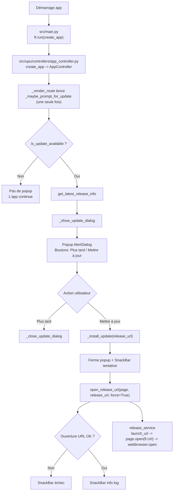

# Organigramme - Processus de mise à jour

Ce document décrit le process "Au lancement, si une nouvelle version
sur GH existe" et ce qui se passe après clic sur "Mettre à jour".

## Vue globale (flowchart)

## Étapes détaillées

1. Point d'entrée

* Fichier: src/main.py
* Le démarrage passe par `ft.run(create_app)`.
* Le lancement part de main.py:1, qui exécute create_app,
puis instancie le contrôleur dans app_controller.py:187.

2. Initialisation du contrôleur

* Fichier: src/upu/controllers/app_controller.py
* `create_app` instancie `AppController`.
* Lors du premier rendu de route, le contrôleur déclenche une tâche async de
vérification dans app_controller.py:75 et app_controller.py:87.

3. Vérification auto au lancement

* Fichier: src/upu/controllers/app_controller.py
* Au premier rendu de route, le contrôleur lance `_maybe_prompt_for_update`
(une seule fois via `_update_check_started`).
* Cette tâche appelle is_update_available
(...) puis récupère les infos release GitHub via get_latest_release_info(...)
(comparaison version locale vs version distante) dans app_controller.py:88 et
implémenté dans config.py:215 et config.py:289.

4. Décision update disponible ou non

* Fichiers: src/upu/controllers/app_controller.py, src/upu/config.py
* `_maybe_prompt_for_update` appelle `is_update_available(self.version)`.
* Si vrai, il récupère aussi `get_latest_release_info()`.

5. Construction du popup

* Fichier: src/upu/controllers/app_controller.py
* `_show_update_dialog(...)` crée un `ft.AlertDialog` modal avec version actuelle,
version disponible, et les boutons `Plus tard` / `Mettre à jour`.

## Clic sur `Mettre à jour`

1. Après clic

* Fichier: src/upu/controllers/app_controller.py
* Le bouton appelle `_install_update(release_url)`.
* `_install_update` ferme le popup, affiche un SnackBar de tentative, puis appelle
`open_release_url(..., force=True)`.
app_controller.py, src/upu/services/release_service.py
* Le clic du bouton appelle _install_update
(release_url) depuis l’action du dialog dans app_controller.py:109.

2. Ouverture effective du lien release

* Fichier principal: src/upu/services/release_service.py
* `open_release_url` tente dans cet ordre:
`page.launch_url(...)` (avec gestion mobile/
APK), puis `page.open(ft.Url(...))`, puis `webbrowser.open(...)`.
* Les événements sont journalisés dans `src/upu/app_data/update_flow.log`.
* L’ouverture réelle est gérée dans release_service.py:132 : journalisation,
tentative page.launch_url (avec logique
Android APK intent si mobile), fallback page.
open(ft.Url) puis webbrowser.open si besoin.

3. Feedback utilisateur final

* Fichier: src/upu/controllers/app_controller.py
* Si échec: SnackBar "Impossible d'ouvrir le lien de mise à jour."
* Si succès: SnackBar avec rappel du chemin de log.
* Enfin, retour utilisateur via SnackBar succès/échec (et chemin de log) dans app_controller.py:154.

→ Précvision: Note utile: le bloc “Mises a jour” visible dans Home est un composant
séparé (carte UI) dans release_update_card.
py:12, mais le pop-up “au lancement” vient bien du contrôleur d’app ci-dessus.

## Fichiers impliqués (résumé)

* src/main.py
* src/upu/controllers/app_controller.py
* src/upu/config.py
* src/upu/services/release_service.py
* src/upu/app_data/update_flow.log
