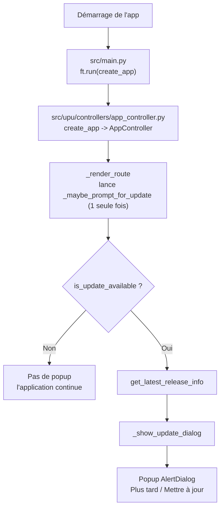
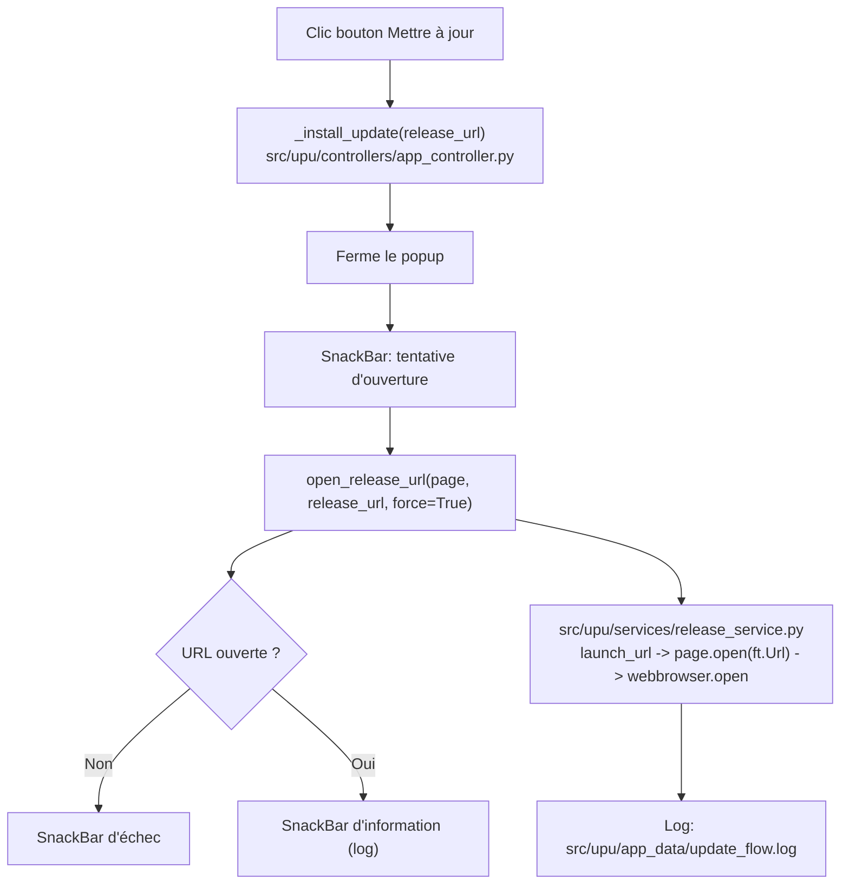

# Organigramme (version présentation)

Ce document présente le processus de mise à jour en 2 blocs visuels:

- avant le clic sur « Mettre à jour »
- après le clic sur « Mettre à jour »

## Bloc 1 - Avant clic (détection et popup)

## Bloc 2 - Après clic sur « Mettre à jour »

## Références fichiers

- src/main.py
- src/upu/controllers/app_controller.py
- src/upu/config.py
- src/upu/services/release_service.py
- src/upu/app_data/update_flow.log

## Lecture rapide

1. L'application démarre et vérifie s'il existe une version plus récente sur GitHub.
2. Si oui, elle affiche un popup de confirmation
   avec « Plus tard » et « Mettre à jour ».
3. Au clic sur « Mettre à jour », elle tente d'ouvrir le lien de release APK.
4. Elle affiche ensuite un retour utilisateur (succès ou échec)
   et journalise la tentative.
