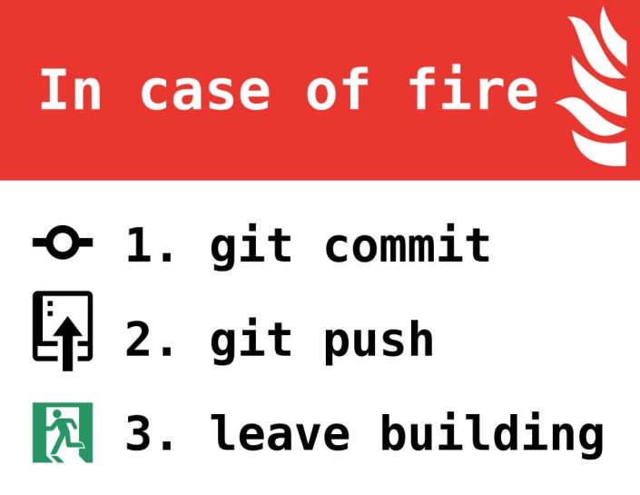
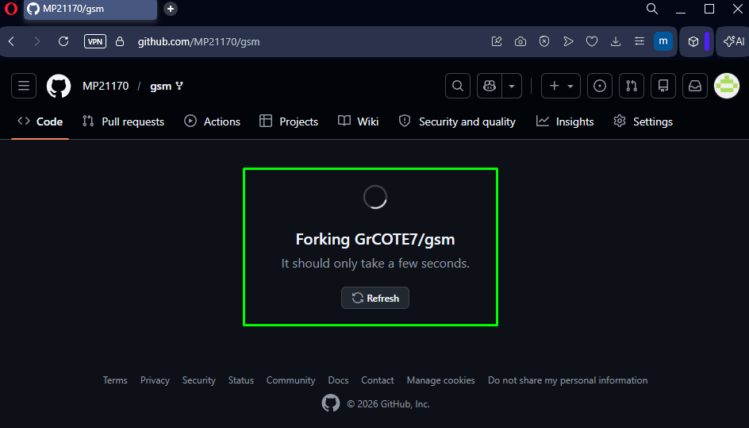
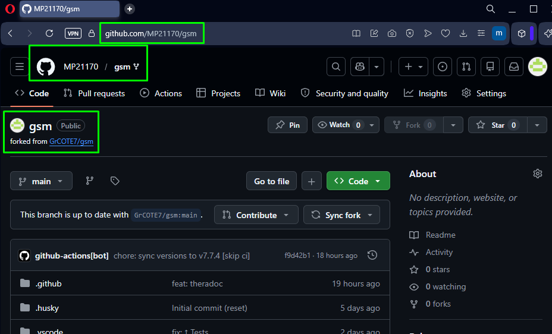

# GIT

### 👉 PRÉAMBULE: À la moindre difficulté, consulte la **[page d'aide](./0000_HELPME.md)**

Outre le fait que Git ait été créé en 2005 par **[Linus Torvalds](https://fr.wikipedia.org/wiki/Linus_Torvalds)**, les grands noms du développement ont rapidement compris qu’il s’agissait d’un outil essentiel. L’une des phrases les plus marquantes est attribuée à Chris Lattner, ingénieur d’Apple (créateur du langage Swift et contributeur majeur à LLVM) :

> **« If it’s not in Git, it doesn’t exist. »**  
> *(Si ton code n’est pas dans Git, c’est qu’il n’existe pas.)*

Et ce n’est pas qu’une formule : Dans le monde professionnel, **MAÎTRISER GIT est un PRÉREQUIS ABSOLU**. Sans versioning, pas de collaboration, pas d’historique, pas de fiabilité.

  

**Git, c’est la base du développement moderne.**

## Bases

Les cours magistraux sont du passé ! Apprenons-le Git pas l'action !

## 1. Fork du projet GSM

Le dépôt principal est sacré : c’est LA source de vérité.

Pour travailler dessus, chacun crée sa copie personnelle.

Et comme 1 dessin > 1000 mots... :

---
→ The origin :

  

---
→ On config notre copie pour usage perso...:

On adapte le name et la descr si on veut, mais surtout, on 'décoche' pour avoir TOUT

  

---

### ⚠️ Dans notre exemple, notre nouveau contributeur s'appelle MP21170... ⚠️

### 😉 Mais bien-sûr, toi, c'est ton *UserName* que tu dois voir à chaque fois à la place 😉

---
→ Envoyez ! C'est pesé ! OU Les jeux sont faits ! OU C'est dans la boîte !

  

---
→ GG, dans ton compte GH !

  

### 🥳 Bravo ! Ceci est TON dépôt 👌

### Une copie conforme et intégrale de la toute dernière version la plus aboutie du Projet GSM Officiel original 😊

---

## → 2. [Clone ton fork en local](./0102_GIT_CLONE.md)
