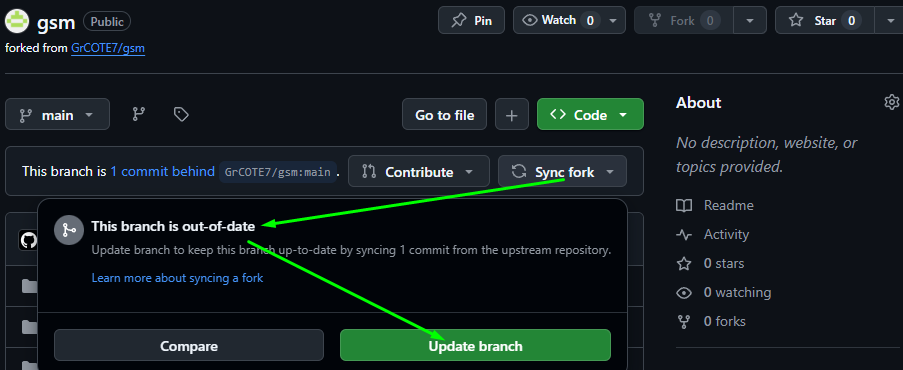
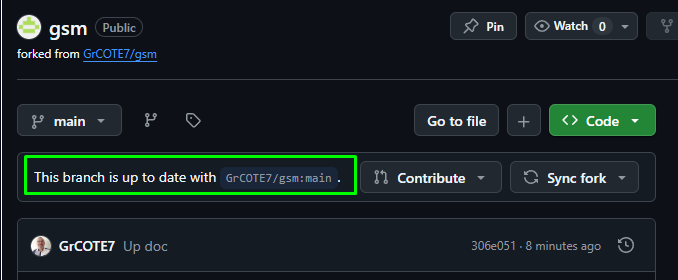
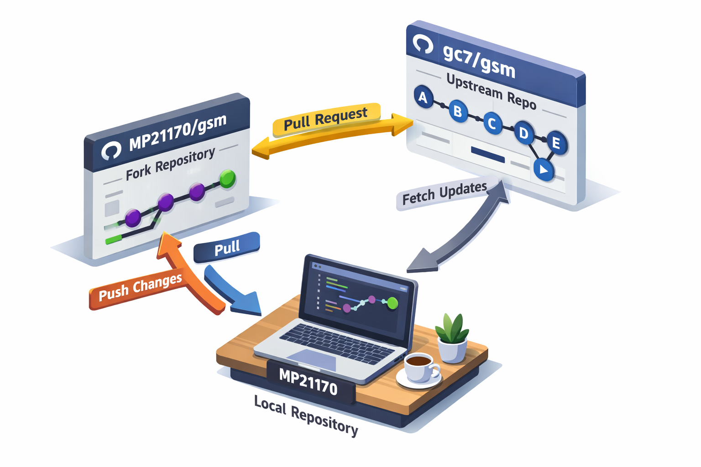

<h3><div align='right'><span style="text-decoration:none;"><a href="./doc/0001_TOC.md" title="Table Of Content">TOC</a></span></div></h3>

<h1><div align='center'>2. GIT CLONE</div></h1>

<h3 align="center">
  <a href="./0101_GIT_FORK.md">← 0101_GIT_FORK</a>
                     
  <a href="./0103_GIT_USE.md">0103_GIT_USE →</a>
</h3>

---

### 👉 PRÉAMBULE (RAPPEL) : À la moindre difficulté, consulte la **[page d'aide](./0000_HELPME.md)**

---

## 2. Clone ton fork en local

Maintenant, pour jouer pleinement avec ce code adopté, va falloir le mettre sur ta machine...

Mais attention... : Si quelques temps sont passés depuis ton fork, p't'être que le dépôt *origin* à évolué... Du coups, tu n'es plus à jour... Et tu vas voir un truc style :

---

### → ***behind*** = derrière en anglais... Pô glop 🙁

<div align="center">
  <a href="./imgs/105_required_sync.png" target="_blank">
    
  </a>
</div>

---

### → Mais 2 clics, et c'est réglé 😊

<div align="center">
  <a href="./imgs/106_required_sync.png" target="_blank">
    
  </a>
</div>

---

### → La preuve dans la 'seconde' qui suit :

<div align="center">
  <a href="./imgs/107_required_sync.png" target="_blank">
    
  </a>
</div>

---

Et quand on est Ok, on y va ! On descend le code sur **notre Mc** (Machine) **personelle LOCALE** :

### 1. Selon ton OS, tu [installes le Git adapté](https://git-scm.com/install)

### 2. Récupère tout le code de ton fork sur ta Mc locale

Dans le dossier de ton choix de ta Mc, ouvre une ***CLI*** (***C**ommand **L**ine **I**nterface*), la console de commandes, et exécute :

```bash
git clone https://github.com/MP21170/gsm.git
```

⚠️ Rappel : N'oublie pas que ***MP21170***, c'est que pour notre exemple ici... Remplace ça par **TON UserName GH** !

### 3. BILAN → Cela **te créée un dossier gsm/ dans lequel tu y as TOUT le code ! 👌**

<div align="center">
  <a href="./imgs/user_fork_upstreal.png" target="_blank">
    
  </a>
</div>

Allons, n'attendons plus ! Voyons ce que cela donne !

→ Entrons dans le dossier, et lançons le *run* ( = On va mettre en route l'application en local ! )

Puis dans les étapes suivantes, nous verrons aussi comment interagir avec ces 3 espaces de dev (Nous comprendrons les termes posés sur les flèches dans le shéma ci-dessus).

---

❌ ## → 3. [Installe les dépendances si nécessaire et lance l'app](./0103_GIT_USE.md)
