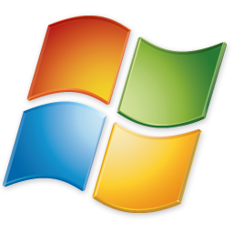
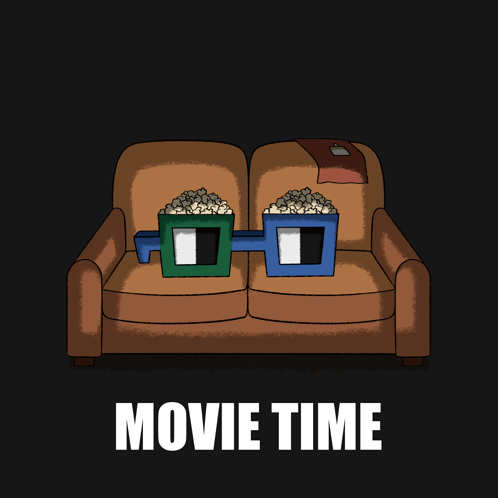

<h3><div align='right'><span style="text-decoration:none;"><a href="./doc/0001_TOC.md" title="Table Of Content">TOC</a></span></div></h3>

<h1><div align='center'>GIT USE</div></h1>

<h3 align="center">
  <a href="./0102_GIT_CLONE.md">← 0102_GIT_CLONE</a>
                     
  <a href="./0104_GIT_BRANCH.md">0104_GIT_BRANCH →</a>
</h3>

---

## 3. Utilise ton projet

Pour se faire, et avoir le programme en local opérationnel, il te faut installer les dépendances (si nécessaire) et lancer l'App.

Depuis le dossier où tu as cloné le repo, ouvre une **CLI**' (Rappel : CLI = Console)  et entre dans le dossier du projet **gsm/** avec :

```bash
cd gsm
```

### 🔧 Vérifie que **uv** est installé

Pour exécuter cet outil 'magique', vérifie que tu l'as installé :

```bash
uv --version
```

Si ça renvoie une version → OK.

✔️ Sinon, installe uv !

 WIN

```bash
iwr https://astral.sh/uv/install.ps1 -useb | iex
```

 LINUX / MacOS

```bash
curl -LsSf https://astral.sh/uv/install.sh | sh
```

## 🚀 Lancer l’app

→ L’**installation des dépendances et** le **lancement del'App** se font en **une seule commande** 💪 !

```bash
uv run flet run
```

👉 À noter: Il existe même un raccourci... (*... Encore + court !!! Lol*) à exécuter toujours en CLI à la racine :

```bash
./go
```

### Avant d'aller + loin, teste que l'app marche au moins pour TOI, là, en local (Et sinon: CHAT, [ISSUE](https://github.com/GrCOTE7/gsm/issues/new/choose) bref, plan [ORSEC](https://fr.wikipedia.org/wiki/Dispositif_ORSEC)!!! Heu... Simplement **[page d'aide](./0000_HELPME.md)** plutôt !)

|  | En principe, l'app doit se lancer, donc, et tu dois en [voir la page d'accueil](https://www.youtube.com/watch?v=UFc07Os-qTo), telle qu'elle est, au moment de la rédaction de ces lignes, et même interagir avec elle, comme ce que tu vois dans [la vidéo (3'18)](https://www.youtube.com/watch?v=UFc07Os-qTo), après exécution de la commande **./go** ! |
|---------------------------------------------|------------------------------------------------------------------------------------------------------------------------------------------------------------------------------------------------------------------------------------------------------------------------------------------------------------------------------------------------------------|

---

#### .❌ Si ce n'est pas le cas : Signale-le dans le [Chat LIVE](https://discord.com/channels/1056923339546968127/1507316257580519445) à minima, ou [ISSUE](https://github.com/GrCOTE7/gsm/issues/new/choose) ! Et bien-sûr, et c'est **10 000 X mieux**, si tu sais déjà la faire : **PR** (**P**ull **R**equest) pour corriger la doc tel que ce problème soit définitivement résolu  pour tous ! Ne tkt pas si tu n'en es pas encore là, car **que TU EN SOIES CAPABLE AU + VITE EST NOTRE 1ER OBJECTIF** 👌.

Donc, si tout va bien, à ce stade, l'app 'tourne', et tu dois voir que la fenêtre de sortie de l'app s'actualise automatiquement dès un seul caractère du code modifié... Même si elle n'est pas forcément à un endroit optimal, selon ton matériel... Pour le moment, le cas échéant, fais la simplement glisser ailleurs afin qu'elle ne te gêne pas !

#### 💡 Pour modifier la page d'accueil avec n'importe quel éditeur, et ainsi **voir IMMÉDIATEMENT que tout marche bien** dont le hot-reload : Ouvre ce fichier: ***gsm\src\upu\views\tests.py*** et modifie la ligne - elle se trouve plutôt sur la fin du script, dans le *return* de la fct *build()*...

```python
"Page pour tests rapides.",
```

#### en :

```python
"Page de MP21170 pour tests rapides.",
```

#### Et observe ta fenêtre de l'app : Se met-elle bien à jour 'toute seule' ?

( *Psssiiittt: On est d'accord, tu as spontanéménent pensé à bien **remplacer MP21170 par TON NOM d'UserName GH** 😜...(Même si là, ce n'est pas gravissime) ?* )

## 🛠️ Gérons maintenant la position de la fenêtre de l'App

Aussi, considérons que tu n'as qu'un seul écran. Tu sauras adapter aisément si tu en a + 😉 !

Perso, dans un tel cas (1 seul écran dispo), je consacre 2/3 à 4/5 de la surface à l'éditeur, et le reste pour l'app. Du coup, plus besoin de toucher à rien, juste au code, et on voit direct le résultat ! En +, on a certainement une fenêtre d'app proche de la taille du rendu sur mobile, et n'oublions pas que nous seuls, codeurs, préférons encore un bon vieux PC, tous les autres sont maintenant prioritairement convertis au 'Mobile First'...

Alors, **bonne nouvelle, c'est juste une valeur à indiquer dans un fichier** :

1. Copie .env_example à la racine en **.env**
2. Pour l'heure, la seule valeur à y configurer est **UPU_WINDOW_LEFT** : Elle définit où se positionnera la fenêtre de l'App sur le système d'affichage d'écran par rapport au bord gauche de l'ensemble... **Trouve TA valeur idéale pour un positionnement aux petits oignons**... (*[Encore des Oignons ?!?](../THERA.md#Philosophie---Union-&-DRY)*)
      Nous verrons les autres paramètres en temps utile.

📄 Pour info : Ce **fichier ./.env n'est jamais dans le Git** (Il est à toi, et rien qu'à toi, uniquement local, donc tu peux y mettre toutes infos sensibles sans inquiétude... Et u verrfas que tuy poseras des mots de passes parfois très sensibles... No soucis ! - *Prononcer 'No souçaïde'*)

## 💡 Avoir un dépot 'private' (Que pour TOI !)

On est jamais à l'abri de devoir un jour re-initialiser un projet, même GSM (et peut-être, si on est aussi actifs qu'on l'espère, surtout, GSM !)... Et donc, toutes les valeurs qui sont strictement tiennes dans ce ***.env*** risquent d'être perdues à jamais (Sauf si tu es absolument sûr de penser à le mettre de côté si un jour cette situation de reset extrême arrive... Et crois-moi que ce jour là, 9/10 chances que tu comprennes que le Père Noël , c'est que pour les tous petits... De nombreuses sociétés ont disparus à cause des conséquences fiancières dramatiques de ce seul risque non couvert !)

*Tip*: Rien ne t'empêche d'y stocker, aussi dans ce 'private dépôt', vraiment tout ce que tu veux : De docs admins, factures, etc... Pas besoin forcément du code d'un quelconque langage, mais pas contre, une bonne artborescence bien réfléchie pour y retrouver facilement et rapidement tout doc au besoin... SSL, hautement sécurisé, décentralisé, gratos... Bref, tous tes trucs clés dans un unique support, dispo 24/24, indépendant de tout ton matos perso... Mais n'oublie pas, donc, d'y mettre aussi la copie de ton .env de ton projet GSM ! 😉 !

---

## → 4. [On attaque **le dev** 👌 ? Existons, faisons une BRANCHE !](./0104_GIT_BRANCH.md)
