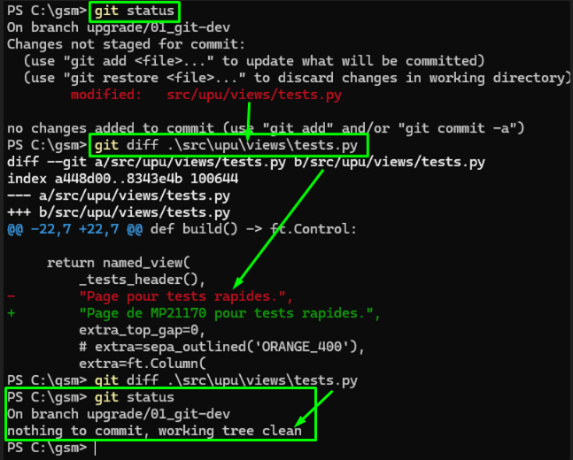

<h3 align='right'><span style="text-decoration:none;"><a href="./0001_TOC.md" title="Table Of Content">TOC</a></span></h3>

<h1 align='center'>4/12. GIT - BRANCH</h1>

<h3 align="center">
  <a href="./0103_GIT_USE.md">← 0103_GIT_USE</a>
                     
  <a href="./0105_GIT_STATUS.md">0105_GIT_STATUS →</a>
</h3>

---

## 4. 🏗️ On attaque **le dev** ? Pas encore ! Car AVANT : 🚨 **Nouvelle BRANCHE & STATUT s'imposent !**

Juste pour te rassurer : Bon, jusqu'à maintenant, beaucoup de lecture pour bien comprendre et tout assimiler... Mais crois-moi : Si demain, tu dois tout recommencer, tu mettras max 2 minutes même si t'es pas doué 😉 ! Et ce principe sera toujours vrai 👍 - Bref, tu ne t'en aperçois p't'être même pas, mais tu d'viens bon 👌 ! Alors, courage pour la suite !

### L’idée principale : 🎯 Une ***BRANCH*** SPÉCIFIQUE pour le dev actuel courant

**Toujours travailler dans une branche dédiée** avant de commencer un développement spécifique.
Cela permet de garder un **historique propre** sur la branche principale (souvent nommée **main**), de **faciliter les revues de code** et d’éviter de casser cette branche critique qui **doit rester stable en permanence**.

C’est une pratique indispensable en **développement collaboratif**, où la stabilité de la branche principale garantit la fluidité et la qualité du travail d’équipe.

Pour info, une **branche** est comme une sorte d’autre **copie intégrale** du projet ! À ceci près que Git (GitHub, GitLab, etc...) ne **duplique pas réellement** tous les fichiers (Mais cela, pour l'heure, on peut continuer à l'ignorer) :

→ Il stocke simplement les **différences** entre les versions, sous forme de petits fichiers texte de quelques octets.

En réalité, Git garde 'simplement' un **historique d’instantanés** (*snapshots*) et de **deltas**, ce qui permet de créer des branches très rapidement, sans consommer d’espace disque inutile.

C’est pour cela qu’on peut **multiplier les branches** sans “gonfler” le dépôt car très léger, mais aussi et surtout, ce traitement est complètement transparent pour nous : Alors, ne pas hésiter à en abuser !

### 🛠️ Donc, étape 1 — Crééer une branche de travail - ***git switch -c dev/branch-name***

Tu peux nommer ta branche comme tu veux, mais voici la [norme idéalement](https://codeheroes.fr/blog/git-comment-nommer-ses-branches-et-ses-commits) :

* Tout en minuscule, aucun accent,
* pas d’espaces, utiliser des tirets - ou /, et
* refléter le type de travail (*feature*, *fix*, doc…) et le sujet du dev

Exemples de conventions :

* feature/new-service
* fix/bug-update-btn
* doc/upgrade-readme

Cela rend l’historique compréhensible et navigable pour toute l’équipe.

→ 🧩 C'est notre 2ème type de commande Git (On a déjà vu *clone*...)

En CLI, elle créée donc une branche 'upgrade/01_git-dev' et te pose dessus :

```bash
git switch -c upgrade/01_git-dev
Switched to a new branch 'upgrade/01_git-dev'
```

( ⚠️ Si tu ne vois pas cela et par contre, le mot '***Aborting***' (Annulé), ça veut dire que quelque chose empêche la commande d'être exécutée... Là, c'est peut-être pas ce que tu as zapé un peu vite le conseil, tout en bas du [doc précédent (0103)](./0103_GIT_USE.md)... Il faut en effet un dépôt 'propre' pour '***switcher***' (basculer) d'une branche à une autre.)

Pour faire le point et avoir la liste des branches existantes :

```bash
git branch
```

→ Affiche les branches locales, avec ' * ' devant le nom de celle où tu es.

(Si dans ta CLI, tu as " : " au lieu de ton invite habituelle, c'est que tu es en mode édition. Tape 'ESC', 'x' ou ':q' pour *e**X**it* ou ***Q**uit* (Pour sortir de cet éditeur [**vi** ou **vim**](https://blog.stephane-robert.info/_astro/vi_demo.9jUPpoF3_Z27rg4g.webp)) )

Pour passer sur une autre branche (Par exemple, revenir sur la branche *main*) :

```bash
git switch main
    # À noter
git switch - # Retour sur la branche précédente (Pas forcément la main)
```

Voici qqes autre commandes très utiles liées aux branches

```bash
git branch ma-branche                    # créée la branche mais sans passer dessus

git branch -d ma-branche                 # détruit la branche (Faut pas être dessus...)
    # + moderne :
git branch --delete ma-branche

git branch -m ancien-nom nouveau-nom     # renomme la branche
    # + moderne :
git branch --move ancien-nom nouveau-nom

git branch -a                            # voir les branches distantes (- a = all)
    # OU :
git branch --all

git checkout HEAD -- fichier.txt
    # + moderne :
git restore fichier.txt
```

---

### Voir les modifs d'un fichier

```bash
git diff filename
```

<div align="center">
  <a href="./imgs/104_git_diff.png" target="_blank">
    
  </a>
</div>

→ Rassure-toi ! Des outils graphiques simplifient énormément ces commandes et leurs rendus...

---

<h3 align="center">
  <a href="./0103_GIT_USE.md">← 0103_GIT_USE</a>
                     
  <a href="./0105_GIT_STATUS.md">0105_GIT_STATUS →</a>
</h3>
