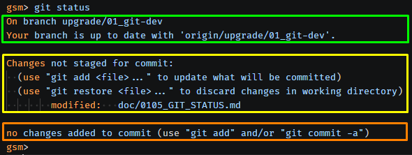

<h3><div align='right'><span style="text-decoration:none;"><a href="./doc/0001_TOC.md" title="Table Of Content">TOC</a></span></div></h3>

<h1><div align='center'>6/9. GIT COMMIT ↓</div></h1>

<h3 align="center">
  <a href="./0105_GIT_STATUS.md">← 0105_GIT_STATUS</a>
                     
  <a href="./0107_GIT_PUSH.md">0107_GIT_PUSH →</a>
</h3>

---

On va reprendre ce qu’on avait obtenu avec la commande ***git status***, car il est **primordial** d’en comprendre chaque terme.

Dans cette sortie, il faut identifier **3 zônes importantes**

<div align="center">
  <a href="./imgs/106_commit.png" target="_blank">
    
  </a>
</div>

<br>

### 1. 🟩 Globalement, tes dépôts 'le local' et 'le distant' sont identiques, si l'on ne considére que les fichiers déjà enregistrés (donc déjà ***push***).

```bash
On branch upgrade/01_git-dev
Your branch is up to date with 'origin/upgrade/01_git-dev'.
...
gsm>
```

### 2. 🟨 Par contre, il existe une modification (dans notre exemple, mais il peut y en avoir plusieurs) qui n’a pas encore été ajoutée pour être validée dans Git

On peut soit l'ajouter avec :

***git add***

ou au contraire, considérer que cette midification ne doit pas être conservée :

***git restore***

```bash
gsm> git status
...
Changes not staged for commit:
  (use "git add <file>..." to update what will be committed)
  (use "git restore <file>..." to discard changes in working directory)
        modified:   doc/0105_GIT_STATUS.md
...
gsm>
```

### 3. 🟧 → On décide de valider notre modification

```bash
gsm> git status
...
no changes added to commit (use "git add" and/or "git commit -a")
gsm>
```

#### 3.1 La validation (***add***)

2 façons de faire :

- **En nommant le ou les fichiers** (Dans ce cas, on met les noms des autres fichiers à la suite, simplement séparés par un espace)

```bash
git add doc/0105_GIT_STATUS.md doc/0106_GIT_LOG.md
```

- **En utilisant un joker** (On valide tous les fichiers correspondant à un motif)

```bash
git add doc/010*.md # Tous les doc/010... au format .md
git add .           # ← Tous les fichiers
```

#### 3.2 L'enregistrement (***commit***)

Une fois les fichiers ajoutés (***staged***), on peut enregistrer la modification dans l’historique :

```bash
git commit -m "Explication du commit et mise à jour de la doc"
```

#### 3.3 Le raccourci puissant : ***git commit -a***

Il existe une commande qui combine ces deux étapes en une seule :

***git commit -a 'commit message'***

Elle permet de :

- Détecter automatiquement tous les fichiers déjà suivis par Git (tracked)
- Les ajouter (comme si tu avais fait git add)
- Puis faire le commit

**Donc, en une seule commande** :

```bash
git commit -a -m "Explication du commit et mise à jour de la doc"
```

---

<h3 align="center">
  <a href="./0105_GIT_STATUS.md">← 0105_GIT_STATUS</a>
                     
  <a href="./0107_GIT_PUSH.md">0107_GIT_PUSH →</a>
</h3>
