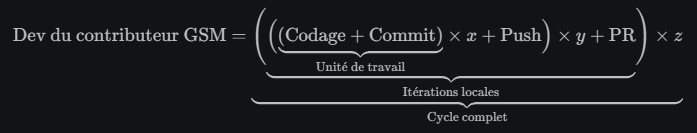

<h3><div align='right'><span style="text-decoration:none;"><a href="./doc/0001_TOC.md" title="Table Of Content">TOC</a></span></div></h3>

<h1><div align='center'>7/9. GIT PUSH ↑</div></h1>

<h3 align="center">
  <a href="./0106_GIT_COMMIT.md">← 0106_GIT_COMMIT</a>
                     
  <a href="./0108_GIT_EXO.md">0108_GIT_EXO →</a>
</h3>

---
  
La dernière étape du cycle des itérations locales (Souvenez-vous...)

<div align="center">
  <a href="./imgs/301_GIT.png" target="_blank">
    
  </a>
</div>

## Synchronisation de ton projet en local (tes fichiers) et de ton dépôt distant (Sur GH)

Alors, comme ça... **Vous avez agît**...? Codé, fait des commits... **B R A V O S !**

Et du coup, voyons ce que 'raconte' *git status*... :

```bash
gsm> git status
On branch main
Your branch is ahead of 'upgrade/01_git-dev' by 1 commit.
  (use "git push" to publish your local commits)

nothing to commit, working tree clean
gsm>
```

Maintenant, afin que ce que tu as fait codé compte vraiment, il faut, comme le suggère la CLI, '***push***' tes *commits*.

C'est l'étape **la plus importante**, celle qui rend 'ton travail enregistré dans le marbre' !

## 🚀 L’action correcte : pousser vers le remote

La commande :

```bash
git push
```

est correcte **à condition** que :

- Ta branche locale main soit bien liée à ***origin/main***,
- ton remote origin pointe bien vers ton dépôt GitHub,
- tu aies les droits d’écriture (ce qui est le cas ici, vu que tu es dans ton *fork*).

### 👉 *Même si tu découvriras bientôt des outils qui simplifient complètement, rendent rapides, intuitives et ludiques ces commandes car applicables 'à simples coups de souris', il est toujours bon et parfois salvateur de connaître les commandes de base en console.*

---

<h3 align="center">
  <a href="./0106_GIT_COMMIT.md">← 0106_GIT_COMMIT</a>
                     
  <a href="./0108_GIT_EXO.md">0108_GIT_EXO →</a>
</h3>
