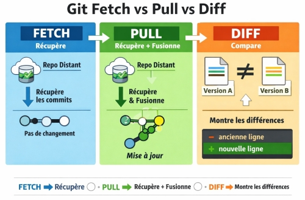

<h3><div align='right'><span style="text-decoration:none;"><a href="./doc/0001_TOC.md" title="Table Of Content">TOC</a></span></div></h3>

<h1><div align='center'>9/12. GIT SYNC</div></h1>

<h3 align="center">
  <a href="./0108_GIT_EXO.md">← 0108_GIT_EXO</a>
                     
  <a href="./0110_GIT_PR.md">0110_GIT_PR →</a>
</h3>

---

## Tu te souviens de ce schéma ?

<div align="center">
  <a href="./imgs/user_fork_upstreal.png" target="_blank">
    
  </a>
</div>

On a vu les inter-actions Fork - Local (Flèches orange et bleue)

Maintenant, on va s'intéresser aux inter-actions avec le *upstream* (Flèches grise et jaune)

## Les interactions avec l'upstream

### 🔄 Fetch upstream (flèche grise)

Le **fetch upstream** permet de récupérer les modifications du dépôt original dans ton fork, **sans les fusionner** dans ta branche locale.

```bash
# Vérifier d'abord si l'upstream existe déjà
git remote -v

# Si "upstream" n'apparaît pas dans la liste, l'ajouter :
git remote add upstream https://github.com/GrCOTE7/gsm.git

# Récupérer les modifications de l'upstream
git fetch upstream
```

> ✅ Le `fetch` ne modifie **pas** ton code local. Il met juste à jour les infos de l'upstream en local.

---

### 🟡 Merge / Rebase upstream (flèche jaune)

Une fois le fetch fait, on intègre les modifications de l'upstream dans ta branche locale.

**Option 1 — Merge** (simple, conserve l'historique)

```bash
git merge upstream/main
```

**Option 2 — Rebase** (historique plus propre)

```bash
git rebase upstream/main
```

> 💡 Le rebase "rejoue" tes commits **par-dessus** les nouveaux commits de l'upstream. Préférable sur une branche de feature.

---

### 🔁 Workflow complet de synchronisation

```bash
# 1. Basculer sur ta branche principale D'ABORD
git checkout main

# 2. Récupérer les dernières modifs de l'upstream
git fetch upstream

# 3. Intégrer les modifs
git merge upstream/main

# 4. Pousser la mise à jour sur ton fork (GitHub)
git push origin main
```

Cela te permet d'avoir ta *main*, toute proche et conforme au dépôt GH source upstream (Comme [tu l'avais peut-être synchronisé directement sur GH, juste avant ton clone](./0102_GIT_CLONE.md))

---

### ⚠️ Et si t'as des conflits ?

Si l'upstream a modifié les **mêmes fichiers** que toi, Git va signaler un conflit, et marque les fichiers concernés comme ceci :

```bash
# Git t'indique les fichiers en conflit
git status
```

### 1. Ouvrir le fichier conflictuel (dans VS Code par exemple)

```diff
<<<<<<< HEAD
ton code à toi (ta version locale)
=======
le code de l'upstream (leur version)
>>>>>>> upstream/main
```

Et garde la seule (ou les seules lignes) que tu veux, selon le marqueur présent pour t'aider.

- `Accept Current Change` → garde ta version
- `Accept Incoming Change` → garde la version upstream
- `Accept Both Changes` → garde les deux (l'une après l'autre)
- `Compare Changes` → voir les différences côte à côte

### 2. Supprimer les marqueurs Git (Si ton éditeur ne t'affiche pas les marqueurs)

```diff
<<<<<<< HEAD
=======
>>>>>>> upstream/main
```

Ces lignes doivent disparaître du fichier final, peu importe ce que tu choisis de garder comme code.

### 3. Sauvegarder, puis

```bash
git add fichier_resolu.txt
git merge --continue   # ou : git rebase --continue
```

> 🧠 Un conflit = deux versions qui s'affrontent. À toi de choisir quelle version garder (ou de fusionner les deux).

---

## Résumé visuel

| Action                 | Commande                        | Effet                                      |
|------------------------|---------------------------------|--------------------------------------------|
| Lier l'upstream        | `git remote add upstream <url>` | Connecte le dépôt original                 |
| Récupérer (fetch)      | `git fetch upstream`            | Met à jour les infos sans toucher ton code |
| Fusionner (merge)      | `git merge upstream/main`       | Intègre les changements                    |
| Tout en un             | `git pull upstream main`        | Fetch + Merge en une commande              |
| Mettre à jour son fork | `git push origin main`          | Synchronise ton fork sur GitHub            |

<div align="center">
  
</div>

---

> 🎉 Ton fork est maintenant **à jour** avec le projet original. Tu peux continuer à coder sans être en retard sur le projet !

Cela te permet d'avoir la *main*, toute proche conforme au dépôt GH source (Comme [tu l'avais peut-être synchronisé directement sur GH, juste avant ton clone](./0102_GIT_CLONE.md))

---

<h3 align="center">
  <a href="./0108_GIT_EXO.md">← 0108_GIT_EXO</a>
                     
  <a href="./0110_GIT_PR.md">0110_GIT_PR →</a>
</h3>
