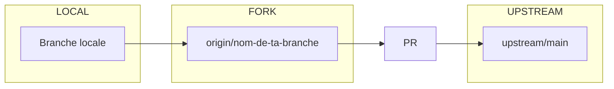
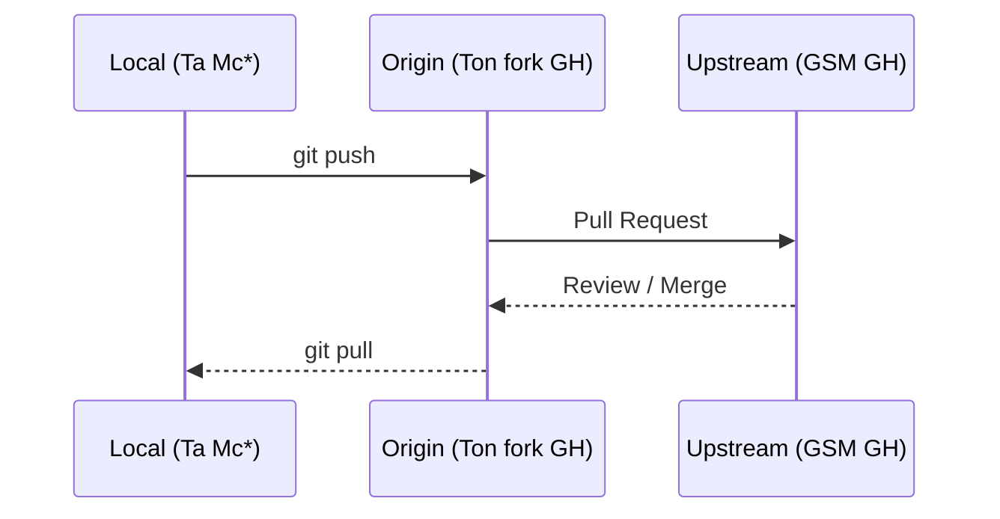

<h3><div align='right'><span style="text-decoration:none;"><a href="./doc/0001_TOC.md" title="Table Of Content">TOC</a></span></div></h3>

<h1><div align='center'>10/12. GIT PR (CLI)</div></h1>

<h3 align="center">
  <a href="./0109_GIT_SYNC.md">← 0109_GIT_SYNC</a>
                     
  <a href="./0111_GIT_PR_GH.md">0111_GIT_PR_GH →</a>
</h3>

---

### 👉 PRÉAMBULE (Rappel) : À la moindre difficulté, consulte la **[page d'aide](./0000_HELPME.md)**

---

Tu vas voir qu'une PR, ce n'est pas "un truc de senior" : c'est juste une méthode propre pour proposer une amélioration.



---

## PR en CLI : Objectif

Une **PR** est une demande de fusion de ton code vers le dépôt cible.

Dans notre contexte GSM, cela signifie :

- Tu développes sur ton **fork**,
- tu pushes ta branche de dev sur ton fork,
- puis tu demandes à fusionner cette branche vers le dépôt **upstream**.
- À la fin, tu récupères en local la version la plus à jour et validée.



ℹ️ * : Mc = machine.

NB : Dans un codespace, le [PR ne se fait simplement via le site GH](./0111_GIT_PR_GH.md)
(En CLI, c'est possible, mais faut [ajouter gh-cli](./110_pr_cli_codespace.png), [définir le repo default, et après, on peut PR)(/110_pr_cli_codespace2.png)...)

---

## Avant de créer la PR : Mini-check

Dans ta branche de travail ( Pas `main` ), vérifie :

```bash
git status
git log --oneline -n 5
git branch --show-current

```

Pour réussir ta PR, tu dois idéalement avoir :

- un arbre propre (`working tree clean`),
- des commits clairs,
- une branche autre que `main` bien nommée (`fix/...`, `doc/...`, `feature/...`).

Si ta branche n'est pas encore sur GH :

```bash
git push -u origin nom-de-ta-branche
```

Le `-u` crée le lien local <-> distant. Ensuite, un simple `git push` suffit.

Sinon, comme ta branche est déjà reliée (C'est le cas si tu es dans notre exemple du fork de GSM), cela suffit :

```bash
git push
```

### Crée la PR en CLI

Vérifie d'abord que `gh` est disponible, si tu en doutes :

```bash
gh --version
```

Puis crée la PR :

```bash
gh pr create \
  --base main \
  --head TonUserName:nom-de-ta-branche \
  --title "doc: corrige fautes et clarifie 0109/0110" \
  --body "Corrections de doc + clarifications mineures."
```

ℹ️ --base main = branche main du dépôt upstream (gc7/gsm).

ℹ️ TonUserName = **ton pseudo G**it**H**ub (celui visible dans l’URL de ton fork).

Vérifier ensuite :

```bash
gh pr list
gh pr view --web
```

CCC: Capture du retour CLI de `gh pr create` avec URL de la PR.

---

## Mettre à jour une PR déjà ouverte (toujours en CLI)

Une PR n'est pas figée. Si on te demande des ajustements :

1. Tu modifies ton code localement sur **la même branche**
2. Tu commits
3. Tu pushes

```bash
git add .
git commit -m "doc: applique retours review"
git push
```

La PR se met alors automatiquement à jour 👍.

## Résumé express CLI

```bash
# 1) créer branche
git switch -c doc/ma-premiere-pr

# 2) coder
# ...

# 3) commit
git add .
git commit -m "doc: ma premiere contribution"

# 4) push
git push -u origin doc/ma-premiere-pr

# 5) ouvrir PR en CLI
gh pr create --base main --head TonUserName:doc/ma-premiere-pr --title "doc: ma première contribution" --body "Correction doc"
```

> 🎯 Objectif atteint quand ta PR est ouverte, lisible, et facile à relire.

---

Pour la méthode via l'interface web GitHub (+ facile), passe au chapitre suivant :

## 👉 [0111_GIT_PR_GH](./0111_GIT_PR_GH.md)

---

<h3 align="center">
  <a href="./0109_GIT_SYNC.md">← 0109_GIT_SYNC</a>
                     
  <a href="./0111_GIT_PR_GH.md">0111_GIT_PR_GH →</a>
</h3>
