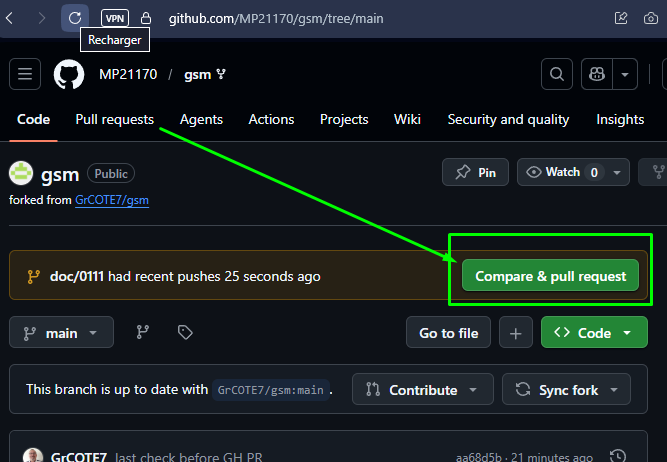
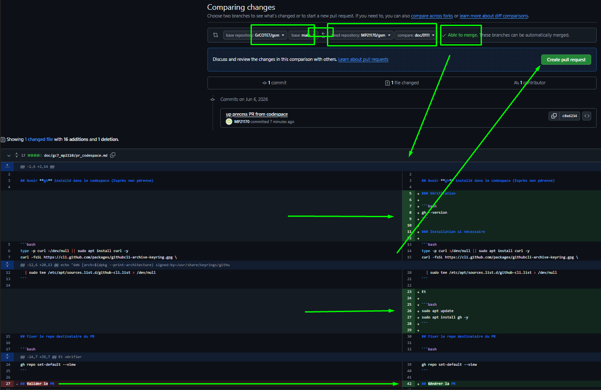
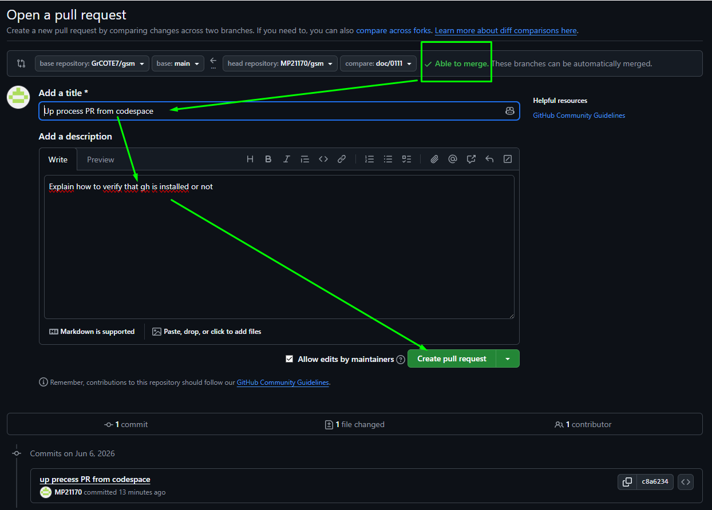
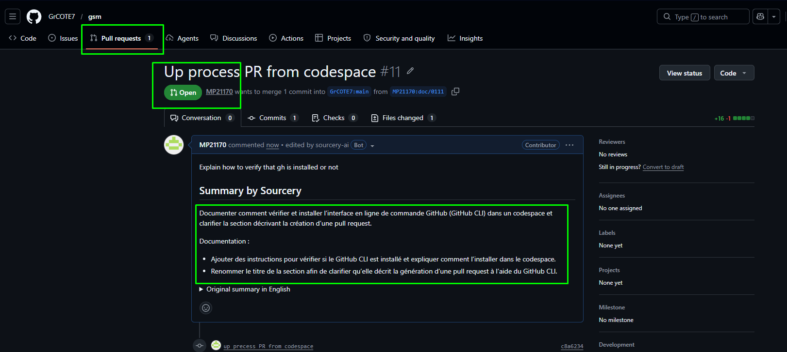
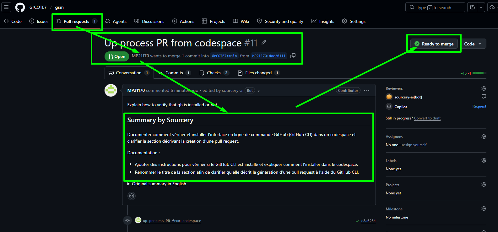
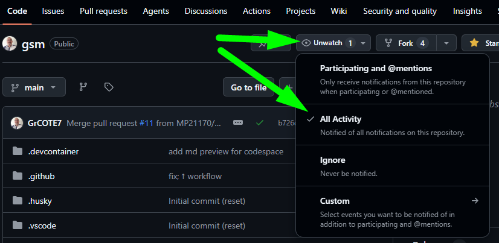

<h3 align='right'><span style="text-decoration:none;"><a href="./0001_TOC.md" title="Table Of Content">TOC</a></span></h3>

<h1 align='center'>11/12. GIT <b>PR</b> (SITE <b>GH</b>)</h1>

<h3 align="center">
  <a href="./0110_GIT_PR.md">← 0110_GIT_PR</a>
                     
  <a href="./0112_GIT_PR_DEAL.md">0112_GIT_PR_DEAL →</a>
</h3>

---

### **La dernière étape et la + importante : Celle qui te permet d'officialiser ton dev :**

## **→ PR sur le site GH : La Puissance Ultime du Git et la Simplicité en + !**

---

Tu fais ton dev en local comme d'habitude, tu *commit*, tu *push*, etc...

Quand tu te sens prêt, tu es content de ton dev, tu ouvres et gères toute la PR dans l'interface GitHub.

---

## 1. Checklist rapide avant d'ouvrir la PR

✅ **Avant d'ouvrir ta PR, vérifie que :**

- [ ] `git branch --show-current` → Tu es bien sur ta branche de dev (Et pas sur `main`) ?
- [ ] `git status` ne montre aucun fichier modifié non commité ?
- [ ] `git fetch upstream` et `git log HEAD..upstream/main --oneline` # vide = tu es à jour avec `upstream/main` (pas de conflits) ?
- [ ] `git push` → Ton push passe sans erreur ?

    (Si tu n'a rien à `push`, cette commande 'te dira' : *'*Everything up-to-date* - Tout est à jour 😁 )
- [ ] Tu as relu tes modifications une dernière fois sur GitHub (`/compare`) ?

---

## 2. Ouvre la page de PR sur GitHub

### 2.1 GitHub propose le bouton **Compare & pull request** juste après le push

<div align="center">
  <a href="./imgs/111_pr_gh1.png" target="_blank">
    
  </a>
</div>

### 2.2 Vérifie et compare tes modifications

<div align="center">
  <a href="./imgs/111_pr_gh2.png" target="_blank">
    
  </a>
</div>

### 2.3 Rédige une PR utile (Différente de la capture pour autres idées)

Titre conseillé (court et précis) :

```text
doc: corrige fautes et clarifie 0110
```

Description conseillée :

```markdown
## But
Corriger des erreurs de formulation dans la doc Git.

## Changements
- correction orthographe dans 0109
- reformulation d'un passage ambigu

## Vérification
- lecture complete du chapitre
- liens internes verifies
```

<div align="center">
  <a href="./imgs/111_pr_gh3.png" target="_blank">
    
  </a>
</div>

### Clique sur **Create pull request** et ta page GH montre maintenant

<div align="center">
  <a href="./imgs/111_pr_gh4.png" target="_blank">
    
  </a>
</div>

### Les dépositaires voient

<div align="center">
  <a href="./imgs/111_pr_gh5.png" target="_blank">
    
  </a>
</div>

Ils peuvent d'un seul coup d'oeil, comprendre l'objet de ton dev, comparer ton code dans ses moindres détails comme tu as pu le faire ci-avant, et d'un clic, valider ta demande de fusion (PR) - Note: Ceci n'est pas une IA qui le fait, donc, pas forcément sur le moment... Mais au pire, sous 48-72 H

### Ça y est, BRAVOs ! Tu rentres dans la Légende 🥳👏💪😁👍

---

→ Parfois, il est possible qu'il y ait une ou des raisons de ne pas pouvoir fusionner immédiatement ton dev...

Pas grave, une sorte de dialogue dans la page de ta PR se mets alors en place, dans lequel tout le monde peut intervenir 👍 💪 😊...

## Pour profiter de tous les messages que tu es susceptible de pouvoir recevoir, nous t'invitons cordialement à activer les notifications

<div align="center">
  <a href="./imgs/111_pr_gh6.png" target="_blank">
    
  </a>
</div>

### → Ainsi, tu auras toujours toutes les dernières infos en priorité 👍

## 3. Erreurs fréquentes

### "J'ai commit sur main"

```bash
git switch -c fix/oups-commit-main
git push -u origin fix/oups-commit-main
```

Puis ouvre la PR depuis cette branche.

### "This branch has conflicts"

```bash
git fetch upstream
git rebase upstream/main
# ou git merge upstream/main
git push --force-with-lease   # uniquement si rebase
```

(*`--force-with-lease` est la version prudente du force push.*)

---

<h3 align="center">
  <a href="./0110_GIT_PR.md">← 0110_GIT_PR</a>
                     
  <a href="./0112_GIT_PR_DEAL.md">0112_GIT_PR_DEAL →</a>
</h3>
