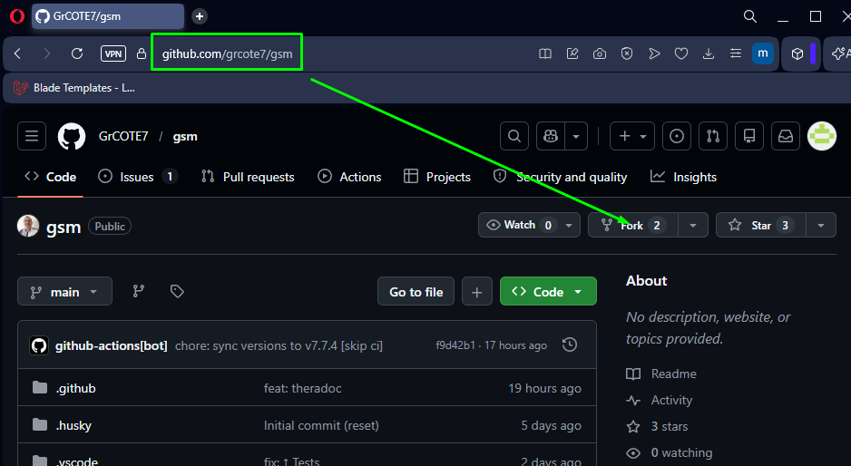
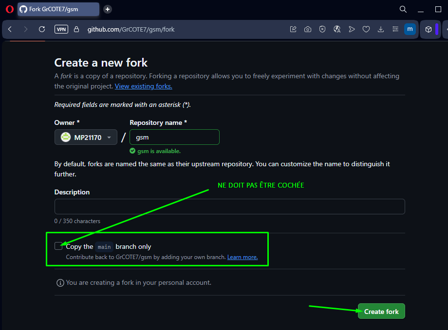
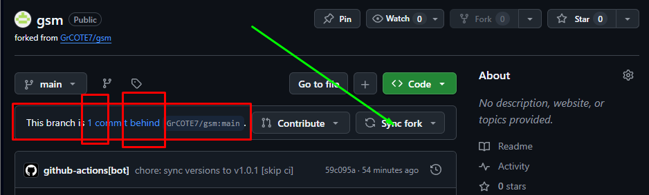

# GIT

Outre le fait que Git ait été créé en 2005 par **[Linus Torvalds](https://fr.wikipedia.org/wiki/Linus_Torvalds)**, les grands noms du développement ont rapidement compris qu’il s’agissait d’un outil essentiel. L’une des phrases les plus marquantes est attribuée à Chris Lattner, ingénieur d’Apple (créateur du langage Swift et contributeur majeur à LLVM) :

> **« If it’s not in Git, it doesn’t exist. »**  
> *(Si ton code n’est pas dans Git, c’est qu’il n’existe pas.)*

Et ce n’est pas qu’une formule : Dans le monde professionnel, **MAÎTRISER GIT est un PRÉREQUIS ABSOLU**. Sans versioning, pas de collaboration, pas d’historique, pas de fiabilité.

**Git, c’est la base du développement moderne.**

## Bases

Les cours magistraux sont du passé ! Apprenons-le Git pas l'action !

## 1. Fork du projet GSM

Le dépôt principal est sacré : c’est LA source de vérité.

Pour travailler dessus, chacun crée sa copie personnelle.

Et comme 1 dessin > 1000 mots... :

---
→ The origin :

<p align="center">
  <a href="./imgs/01_fork.png" target="_blank">
    
  </a>
</p>


---
→ On config notre copie pour usage perso...:

On adapte le name et la descr si on veut, mais surtout, on 'décoche' pour avoir TOUT



---

### ⚠️ Dans notre exemple, notre nouveau contributeur s'appelle MP21170... ⚠️

### 😉 Mais bien-sûr, toi, c'est ton *UserName* que tu dois voir à chaque fois à la place 😉

---
→ Envoyez ! C'est pesé ! OU Les jeux sont faits ! OU C'est dans la boîte !


---
→ GG, dans ton compte GH !


### 🥳 Bravo ! Ceci est TON dépôt 👌

### Une copie conforme et intégrale de la toute dernière version la plus aboutie du Projet GSM Officiel original 😊

---

## 2. Clone ton fork en local

Maintenant, pour jouer avec ce code adopté, va falloir le mettre sur ta machine...

Mais attention... : Si quelques temps sont passés depuis notre fork, p't'être que le dépôt à évoluer... Du coups, on n'est plus à jour... Et on va voir un truc style :

---

### → ***behind*** = derrière en anglais... Pô glop 🙁



---

### → Mais 2 clics, et c'est réglé 😊 :


---

### → la preuve :


---

Et quand on est Ok, on y va ! On descends le code surt notre Machine :

```bash
git clone https://github.com/MP21170/gsm.git
```

⚠️ N'oublie pas que ***MP21170***, c'est que pour notre exemple... Remplace ça par **TON UserName** !


* [ ] To be continued...

## 3. Installe les dépendances si nécessaire

## 4. Teste que l'app marche au moins pour TOI, en local (Et sinon: [ISSUE](https://github.com/GrCOTE7/gsm/issues/new/choose) !)

### On attaque le dev 👌 ?

1. Crée une branche
    → Toujours travailler sur une branche dédiée - Cool: Tu lui donnes le noms que tu veux ([Enfin, selon le dev que tu penses faire, au moins pas d'espaces, et que cela ait un sens par rapport à ton dev](https://codeheroes.fr/blog/git-comment-nommer-ses-branches-et-ses-commits/)) :

    Exemples:
    
        feature/ma-nouvelle-fonctionnalite

        fix/bug-du-bouton

        doc/amelioration-readme

    → Cela permet de garder l’historique propre et compréhensible.

    Mais du coup, là, t'es 'chez toi', c'est hyper cool ! tu y dev ce que tu veux, cela ne peut jamais rien casser d'important, et tu te plantes ? Bravo, c'est que tu as poussé tes limites :-) ! Et si tu les as trop dépassées... Pas grave: Revient sur la branche main ! Rien n'est jamais perdu ! Rien qagné sur ce coup, mais rien de perdu ! En renouvellant X fois ce genre d'expériences, tu ne peux à termes et statistiquement qu'y gagner, et grandir :-) !

2. Commiter proprement

    Des fois, tu vas réussir ton dev :-) : Tout roule comme tu veux :-) Et tu te dis qu'il te faut impérativement en faire profiter tout le monde, c'est normal, c'est instinctif chez les Hommes de bonnes volontrés... ;-)
    
    Alors, tu vas commit et proposer ton dev: Et un bon commit, c’est :

        Petit
        Clair
        Utile
        Avec un message explicite

      Exemples :

        feat: ajout du module d'analyse
        fix: correction du calcul de score
        docs: ajout section contribution

3. Faire une Pull Request (PR)

    La PR est le cœur de la collaboration. (Là, ça rigole plus car c'est maintenat que ton dev peut devenir 'officiel' :-))

    Avant de voir le détail de cette étape, juste, prenons du recul...:

    - T'as t'on demandé un diploume ?

    - Demandé pour qui tu te prends ? De quel droit tu te permets d'émettre un avis ?

    - Vérifier que t'es le fils à tel Papa, ou autre privilègié ?

    - À quelle dininité tu crois ?

    - Au fait, t'es plutôt caucasien, jaune, gris, brown...? vert ?:?

    → Non : **Ici, là et maintenant, TU ES TOI ! Et enfin, là, ici et maintenant, enfin au bon endroit !!! Seulement TOI, et TOI SEUL**, peut comprendre et accepter l'idée que **TON RÔLE est CAPITAL**, pas indispensable, juste CAPITAL **et IMPORTANT !**

    Concrètement, pour faire valoir ton dev, tu dois :

        Expliquer ce qui a été fait

        Expliquer pourquoi

        Mentionner les issues liées

        Être ouverte au dialogue

    Une PR n’est pas un examen.
    C’est une discussion technique entre humains bienveillants, et la scenette qui s'ajoute et fait qu'on aura ensemble un super film au final !

4. Participer aux revues de code

    Grâce à ton fork, puis clone, un simple Fetch et tu as le dernier apport le + top, et le + récent, d'un collaborateur, et ce, 24/24 - 7/7 et à volonté...

    Et relire le code des autres, c’est :

    * Apprendre

    * Aider facilement

    * Améliorer la qualité globale

    * Renforcer l’esprit d’équipe

    Les commentaires doivent être :

    * Constructifs

    * Respectueux
  
    Argumentés
  
    * Jamais condescendants

    * Raisonables

## Extensions VSCode recommandées

### Spéciales Git

### Et autres importantes
