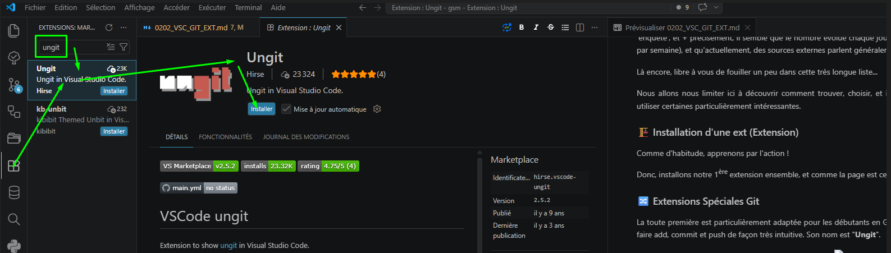
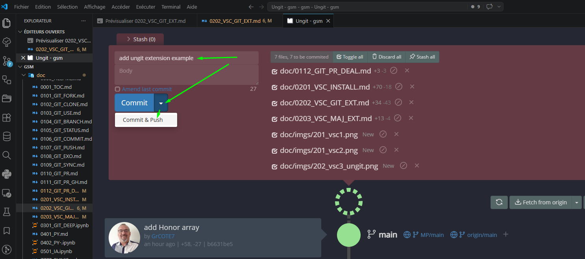
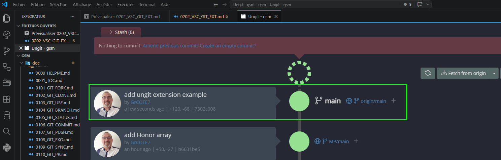
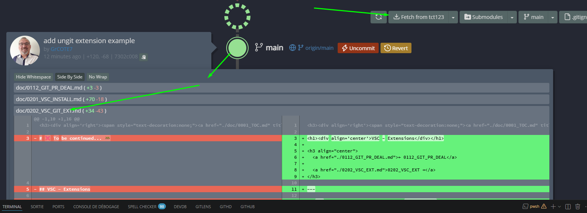

<h3>
<a href="./doc/0001_TOC.md" title="Table Of Content">TOC</a>
</h3>

<h1>
VSC - Extension Un<b>git</b>
</h1>

<h3 align="center">
  <a href="./0200_VSC_INSTALL.md">← 0201_VSC_INSTALL</a>
                     
  <a href="./0202_VSC_EXT02_GG.md">0202_VSC_EXT02_GG →</a>
</h3>

---

## 📋 Extensions VSCode recommandées pour le Git

Précédemment, nous disions au sujet des extensions de VSC : "de très nombreuses extensions existent"... Après 'enquête', et + précisément, il semble que le nombre évolue chaque jour (Plusieurs dizaines de nouvelles extensions par semaine), et qu'actuellement, des sources externes parlent généralement de “**plus de 50 000**” !!!

Là encore, libre à vous de fouiller un peu dans cette très longue liste...

Nous allons nous limiter ici à découvrir comment trouver, choisir, et installer une extension, puis à t'inviter à en utiliser certaines particulièrement intéressantesentre autre, pour notre parfaite collaboration tous ensemble.

Comme à notre habitude, apprenons par l'action !

Donc, installons ensemble notre 1ère extension et comme cette page de doc est celle des extensions VSC pour le Git... :

### 🏗️ Installation d'une Extension Spécifique au Git 🔀

La toute première est particulièrement adaptée aux débutants en Git... Mais elle est tellement sympa, agréable et parfois, marrante, que tu peux bien-sûr continuer à l'utilser ensuite...
En effet, très graphique, on va pouvoir y faire add, commit et push de façon très intuitive. Son nom est "**Ungit**".

  

Pour la lancer:

CTRL + MAJ + P → " ung " → Open Ungit

OU + simple :

### **MAJ + ALT + U**

S'ouvre dans un nouvel onglet - Un simple glissé-déplacé permet de le poser dans l'onglet principal pour profiter au max de l'écran.

Et pour y faire un "add + commit + push", ça se résume à une case à renseigner, et 2 clics !!!

  

Et la conséquence est évidemment très graphique et parlante 😁 !

  

À noter : La présence d'un bouton " Fetch from origin "... Et de la possibilité d'y ajouter là, des remotes...

Et également, chaque gros rond représente un commit... En cliquant dessus, tu vois les fichiers modifiés lors de ce commit, et en cliquant sur le nom du fichier, les lignes changées !!! Plutôt pratique, non ?

  

---

💡Comme tu sais maintenant installer une extention, trouve et install la 'French' si tu veux avoir tout **l'éditeur en français.**

---

<h3 align="center">
  <a href="./0200_VSC_INSTALL.md">← 02001_VSC_INSTALL</a>
                     
  <a href="./0202_VSC_EXT02_GG.md">0202_VSC_EXT02_GG →</a>
</h3>
