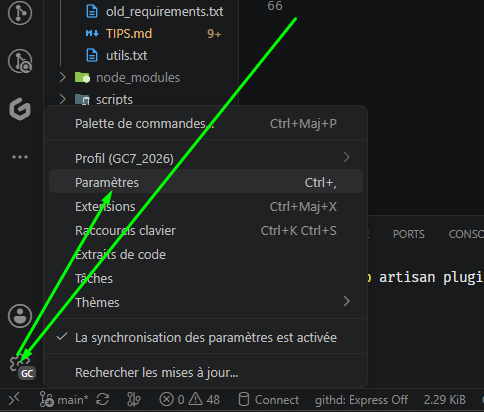
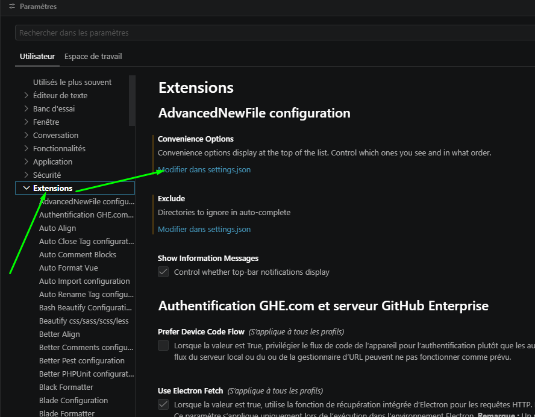

<h3><div align='right'><span style="text-decoration:none;"><a href="./doc/0001_TOC.md" title="Table Of Content">TOC</a></span></div></h3>

<h1><div align='center'>Éditeur <b>VSC</b> - <b>V</b>isual <b>S</b>tudio <b>C</b>ode</div></h1>

<h3 align="center">
  <a href="./0112_GIT_PR_DEAL.md">← 0112_GIT_PR_DEAL</a>
                     
  <a href="./0202_VSC_EXT.md">0202_VSC_EXT →</a>
</h3>

---

## Pourquoi VSC ?

Il existe des milliers d'éditeurs, + ou moins spécialisés pour une techno voire un language spécifique...

Nous préconisons ici **[VSCode](https://code.visualstudio.com/)** , car :

- Gratos,
- et de très nombreuses extensions existent, dont beaucoup pour le Git**... Comme par hasard...Et qui rende son usage (du Git) aussi ludique que de jouer à Tétris !

<br><div align="center">
    <a href="https://vscode.dev/?vscode-lang=fr-fr" target="_blank"><b>👉 Voyez par vous même en LIVE !</b></a>
</div><br>

À noter que c'est aussi l'éditeur que l'on retrouve dans [nos codespaces](https://codespaces.new/MP21170/gsm) 😉

Mais libre à vous d'utiliser l'éditeur autre que vous voulez, quitte à en adapter vous-même les réglages pour retrouver des fonctionalités avancées comme celles présentées dans les pages qui suivent...

## 🏗️ Installation

### 👉 [Installer VSC](https://code.visualstudio.com/download)

Noter que ce site poopose aussi la documentation de l'éditeur (En anglais)

## 🧰 Raccourcis usuels

Liste non exhaustive :

```dos
ALT + 3 → 31 : ♥ ... ▼
ALT + 24 à 27: ↑ ↓ → ←
ALT + 144, 183 : É À
MAJ + ALT + ↑ ou ↓ : COPIÉ/COLLÉ décalé d'une ligne
ALT + ← : Retourner au précédent code édité (historique)
ALT + → : Revenir au dernier code édité

CTRL + ALT + S : Surround
CTRL + u + u : Min/MAJ switch (bascule)
```

Et de nombreux raccourci habituels même à d'autre programmes, fonctionnent aussi :

CTRl + S : Enregistrer (Encore que l'éditeur permet d'automatiser cela)
CTRL + C / CTRL + V : **C**opier / **V**a !

## 🛠️ Paramétrages

La plupart des réglages se situent dans un fichier "settings.json".
Pour l'éditer :

<div align="center">
  <a href="./imgs/201_vsc1.png" target="_blank">
    
  </a>
</div>

→ Une raccourci existe: CTRL + ' , '

<div align="center">
  <a href="./imgs/201_vsc2.png" target="_blank">
    
  </a>
</div>

→ Si tu connais un moyen + simple, + rapide... : PR ! 😊

Voici quelques params recommandés :

```json
{
"window.title": "${dirty}${activeEditorShort}${separator}${rootName}${separator}${activeEditorMedium}",
"editor.fontSize": 13,
"editor.tabSize": 2,
"editor.rulers": [
  80
],
"files.autoSave": "afterDelay",
"editor.quickSuggestionsDelay": 50,
"editor.formatOnSave": true,
}
```

Dans ce .json, le nom des clé est suffisament évocateur poour que vous en compreniez d'emblée leur rôle... Et naturellement, libre à vous d'adapter leurs valeurs selon vos préférences.

---

<h3 align="center">
  <a href="./0112_GIT_PR_DEAL.md">← 0112_GIT_PR_DEAL</a>
                     
  <a href="./0202_VSC_EXT.md">0202_VSC_EXT →</a>
</h3>
