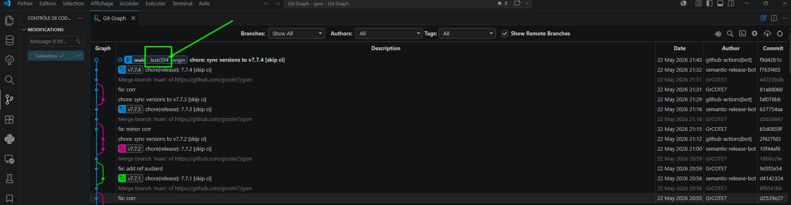
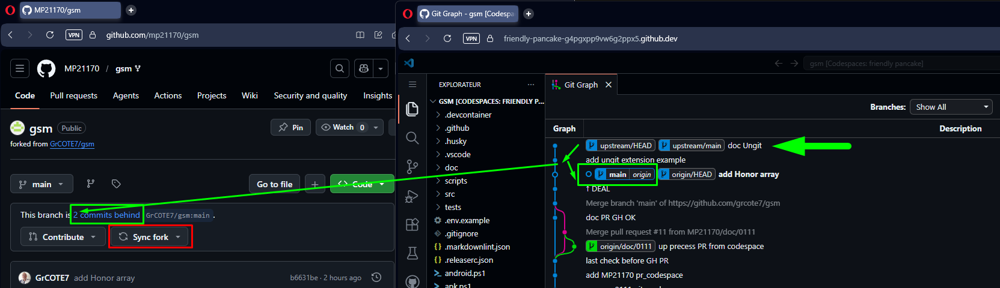
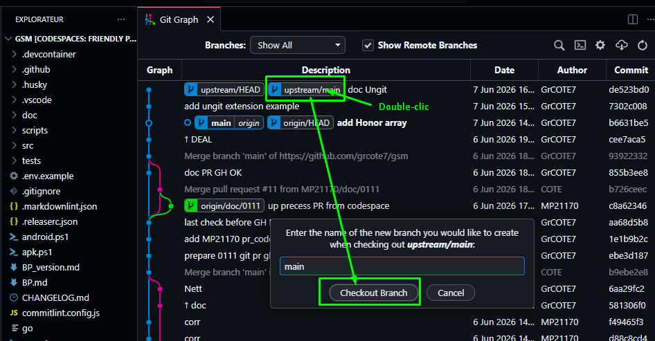
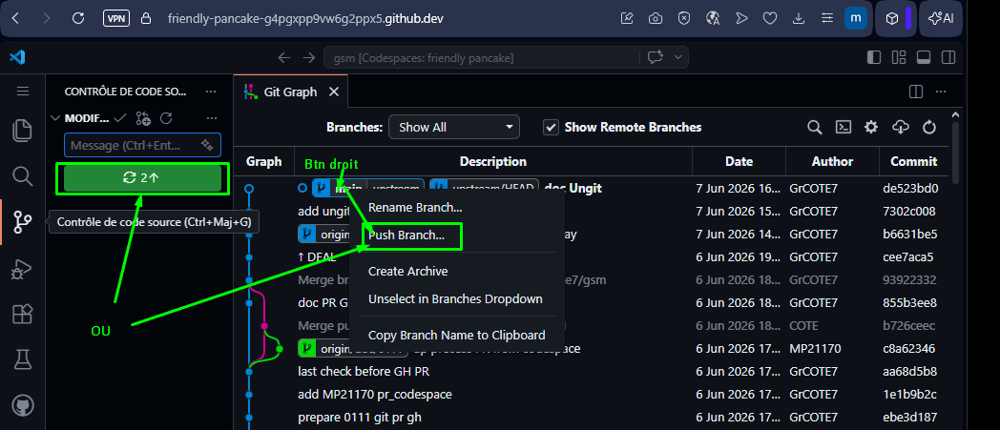
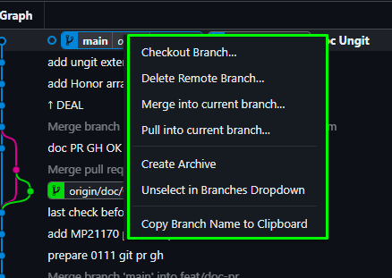
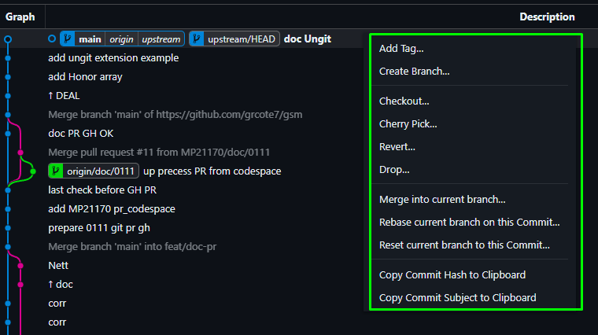

<h3>
<a href="./doc/0001_TOC.md" title="Table Of Content">TOC</a>
</h3>

<h1>
VSC - GG (GitGraph)
</h1>

<h3 align="center">
  <a href="./0201_VSC_EXT01_UNGIT.md">← 0201_VSC_EXT01_UNGIT</a>
                     
  <a href="./0203_VSC_MAJEXT1.md">0203_VSC_MAJEXT1 →</a>
</h3>

---

## 📋 Extensions VSCode recommandées pour le Git (Suite)

**Git Graph - mhutchie**

Je vous laisse la trouver dans le 'magasin'et l'installer en 1 clic...

C'est mon extension préférée - La grande soeur + PRO d'Ungit qui peut faillir sur de gros dépôts... Et surtout, on **peut même y gérer graphiquement les PR !!!**

Et outre le fait de commit, push, fetch, PR, etc.... d'un simple clic ou coup de souris, donc simple et rapide, permet aussi de visualiser le positionnement d'autre contributeurs ! Et fonctionne aussi dans nos codespaces !!!

Clique sur "Git Graph", en bas dans la barre d'état de ton éditeur.
  

  

Tu te souviens quand ton foek est en retard sur l'upstream...? Tu allais sur ton GH et SYNC

  

Là, tu peux tout gérer dans ton éditeur ! Tu passes d'un commit à l'autre d'un simple double-ckic :

  

Confirme le checkout & pull, et là, tu vois que ton main est en gras (C'est ta branche active) et au même niveau que le upstream.

Plus qu'à push et 2 façons de faire :

  

Pour finir, observe que le clic droit sur la branche et le commit offre des fonctionalités différentes 🧮 

  
  &nbsp;&nbsp;&nbsp;
  

Si tu as bien suivi la partie précédent GIT (la série 01xx_GIT des docs), tu ne devrais pas avoir de difficulté à comprendre le rôle de ces fonctionalités.

Et enfin, look que le clic normal sur le commit te montre les fichiers modifiés, puis le clic sur un fichier, les modifications effectuées.

### Et quelques autres importantes pour le Git

Tu as compris qu'en un clic, tu peux installer une extension, et juste un autre clic si tu veux la désinstaller... Alors n'hésite pas à fouiller *à donf* dans la bibliothèque de ces extensions ! Et peut-être un jour feras tu une PR pour en suggérer l'usage d'une d'entre elles 👍

- [Git File History](https://marketplace.visualstudio.com/items?itemName=pomber.git-file-history)
- [gitignore](https://marketplace.visualstudio.com/items?itemName=michelemelluso.gitignore)
- [GitHub Repositories](https://marketplace.visualstudio.com/items?itemName=GitHub.remotehub)

---

<h3 align="center">
  <a href="./0201_VSC_EXT01_UNGIT.md">← 0201_VSC_EXT01_UNGIT</a>
                     
  <a href="./0203_VSC_MAJEXT1.md">0203_VSC_MAJEXT1 →</a>
</h3>
