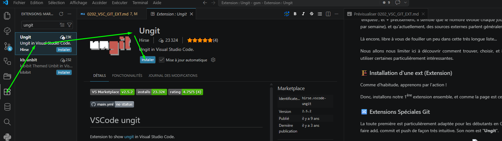

<h3>
<a href="./doc/0001_TOC.md" title="Table Of Content">TOC</a>
</h3>

<h1>
VSC - Extensions
</h1>

<h3 align="center">
  <a href="./0112_GIT_PR_DEAL.md">← 0112_GIT_PR_DEAL</a>
                     
  <a href="./0202_VSC_EXT.md">0202_VSC_EXT →</a>
</h3>

---

## 📋 Extensions VSCode recommandées pour le Git

Précédemment, nous disions au sujet des extensions de VSC : "de très nombreuses extensions existent"... Après 'enquête', et + précisément, il semble que le nombre évolue chaque jour (Plusieurs dizaines de nouvelles extensions par semaine), et qu'actuellement, des sources externes parlent généralement de “plus de 50 000” !!!

Là encore, libre à vous de fouiller un peu dans cette très longue liste...

Nous allons nous limiter ici à découvrir comment trouver, choisir, et installer une extension, puis à t'inviter à en utiliser certaines particulièrement intéressantes.

### 🏗️ Installation d'une ext (Extension)

Comme d'habitude, apprenons par l'action !

Donc, installons notre 1ère extension ensemble, et comme la page est celles des extension pour le Git... :

### 🔀 Extensions Spéciales Git

La toute première est particulièrement adaptée pour les débutants en Git...
En effet, très graphique, on va pouvoir y faire add, commit et push de façon très intuitive. Son nom est "**Ungit**".

  

Pour la lancer:

CTRL + MAJ + P → " ung " → Open Ungit
OU + simple :
MAJ + ALT + U → ungit

* **Ungit** - Hirse - Ungit in Visual Studio Code.
  Idéal pour commit, push, etc... de façons visuelle ! Parfait pour débuter et comprendre le git.
  À noté: Observé que le lien de commande Ungit n'apparaît pas toujours dans la barre d'état, en bas - Lien pratique car un clic dessus ouvre l'outil.
  Mais si tel est le cas pour toi, CTRL + MAJ + P → Ungit → Clic / Open Ungit (Tu découvriras alors le rappel du raccourci pour l'ouvrir directement: MAJ + ALT + U dans un nouvel onglet - Un glissé-déplacé permet de le poser dans l'onglet principal pour profiter au max de l'écran)

---

* Git Graph - mhutchie - View a Git Graph of your repository, and perform Git actions from the graph.
  Mon extension préférée - Le grand frère + PRO d'Ungit qui peut faillir sur de gros dépôts...
  Outre le fait de commit, push, fetch, etc.... d'un simple clic ou coup de souris, donc simple et rapide, permet aussi de visualiser le positionnement d'autre contributeurs ! Et fonctionne aussi en codespace !!!
  
  

    
  

# ❌ To be continued... 🚧

* [ ] Git File History - Rodrigo Pombo
* [ ] gitignore - michelemelluso - Add file to .gitignore
* [ ] GitHub Repositories - GitHub - Remotely browse and edit any GitHub repository

### Et autres importantes
