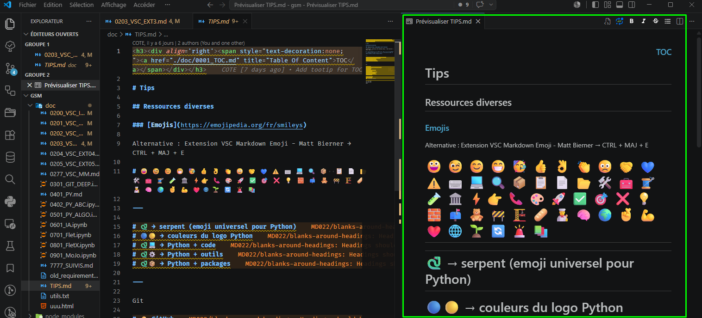
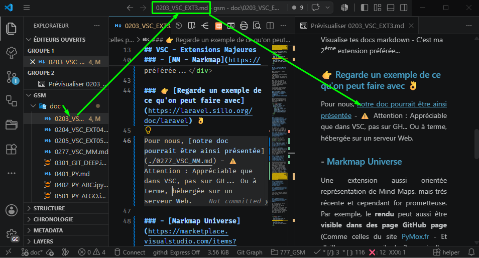
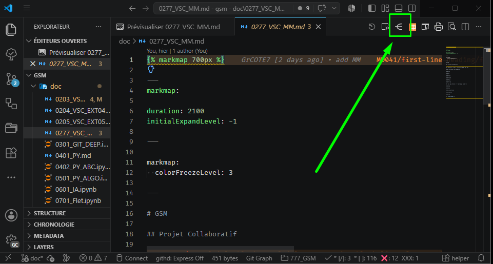
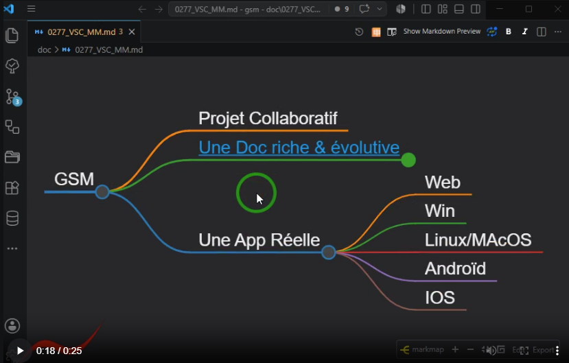

<h3>
<a href="./doc/0001_TOC.md" title="Table Of Content">TOC</a>
</h3>

<h1>
VSC - EXTENSIONS MAJEURES
</h1>

<h3 align="center">
  <a href="./0202_VSC_EXT02_GG.md">← 0202_VSC_EXT02_GG</a>
                     
  <a href="./0204_VSC_EXT04_TODO.md">0204_VSC_EXT04_TODO →</a>
</h3>

---

## VSC - Extensions Majeures (Hors celles pour le Git déjà vues)

Nous allons voir 2 sortes d'extensions :

- Pas besoin particulièrement de paramètres
- Ou nécessite des paramètres pour accomplir ce que l'on en attend.

Donc, pour les premières, nous nous contentons ici de citer leur nom (avec le lien pour les installer en 1 clic) - Juste éventuellement quelques mots...

Les secondes feront chacune l'objet d'une page dédiée à la suite de celle-ci.

### - [Auto-Open Markdown Preview](https://marketplace.visualstudio.com/items?itemName=hnw.vscode-auto-open-markdown-preview)

Ouvre automatiquement sur la droite, la prévisualisation d'un document Markdown à son ouverture.

  

---

### - [Mermaid](https://marketplace.visualstudio.com/items?itemName=MermaidChart.vscode-mermaid-chart) et [Markdown Preview Mermaid Support](https://marketplace.visualstudio.com/items?itemName=bierner.markdown-mermaid)

Tu connais déjà, en fait ! C'est ce genre de schéma que t'as vu lors de la leçon **[Git PR](./0110_GIT_PR.md)**

### - [MM - Markmap](https://marketplace.visualstudio.com/items?itemName=gera2ld.markmap-vscode)

Visualise tes docs markdown - C'est ma 2ème extension préférée...

### 👉 [Regarde un exemple de ce qu'on peut faire avec](https://laravel.sillo.org/doc/laravel) 👌

Pour nous, [notre doc pourrait être ainsi présentée](./0277_VSC_MM.md) - ⚠️ Attention : Appréciable que dans VSC, pas sur GH... Ou à terme, hébergée sur un serveur Web.

  

  

  

### - [Markmap Universe](https://marketplace.visualstudio.com/items?itemName=maxchang.vscode-markmap-universe)

Une extension aussi orientée représentation de Mind Maps, mais très récente et cependant for prometteuse. Par exemple, le **rendu** peut aussi être **visible dans des page GitHub page** (Comme celles du site [PyMox.fr](http://PyMox.fr) - Et d'ailleurs, comme il s'agît aussi d'un projet OpenSource et que tu es maintenant en principe rompu aux PR, n'hésite pas pourquoi pas à poser une petite MindMap sur une des pages... Et un PR ici pour améliorer alors le liens de la démo ci-avant...)

### - [Markdown Emoji](https://marketplace.visualstudio.com/items?itemName=bierner.markdown-emoji)

CTRL + MAJ + E (Comme **E**xtension) pour en choisir un. Pour les + usités pour illustrer du texte, un [fichier TIPS dans notre doc/](./TIPS.md) permet d'en selectionner un rapidement 😉 (Vois la capture juste tout en haut de cette page...).

### - [Markdown+Math](https://marketplace.visualstudio.com/items?itemName=goessner.mdmath)

Pour avoir de belles formules scientifique ou mathématiques dans tes docs, comme celle que tu connais déjà et qui résume le quotidien d'un codeur (Au passage, elle a certainement + de sens pour toi maintenant...) :

$$
\textcolor{white}{\text{Dev du contributeur GSM} =}
\underbrace{
\Bigg(
    \Big(
      \underbrace{
          \underbrace{
            \textcolor{cyan}{(\text{Codage} + \text{Commit})}
          }_{\textcolor{cyan}{\text{Unité de travail}}}
          \textcolor{lime}{\times x}
          + \textcolor{yellow}{\text{Push}}
        \textcolor{lime}{\times y}
      \Big)
      }_{\textcolor{yellow}{\text{Itérations locales}}}
      + \textcolor{orange}{\text{PR}}
    }_{\textcolor{orange}{\text{Cycle complet}}}
\Bigg)\textcolor{lime}{\times z}
$$

---

### - [Jupyter](https://marketplace.visualstudio.com/items?itemName=ms-toolsai.jupyter)

Si tu fouilles la bibliothèque des extensions, tu verras qu'il y a pas mal d'extensions qui upgrade encore celle-ci...

Quoi qu'il en soit, nous nous en servirons dorénavant, dès le chapitre suivant presque systématiquement, car adaptée pour faire du code Python exécutable dans la doc !!!

---

<h3 align="center">
  <a href="./0202_VSC_EXT02_GG.md">← 0202_VSC_EXT02_GG</a>
                     
  <a href="./0204_VSC_EXT04_TODO.md">0204_VSC_EXT04_TODO →</a>
</h3>
