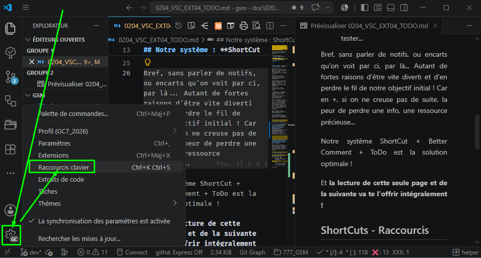
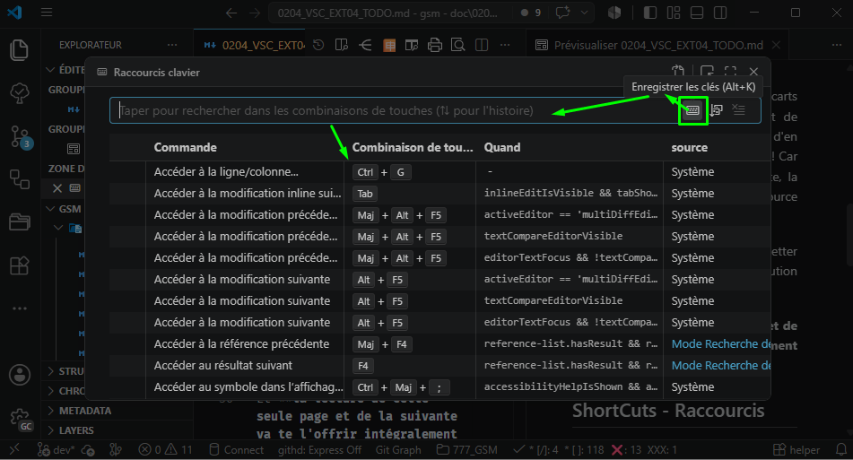
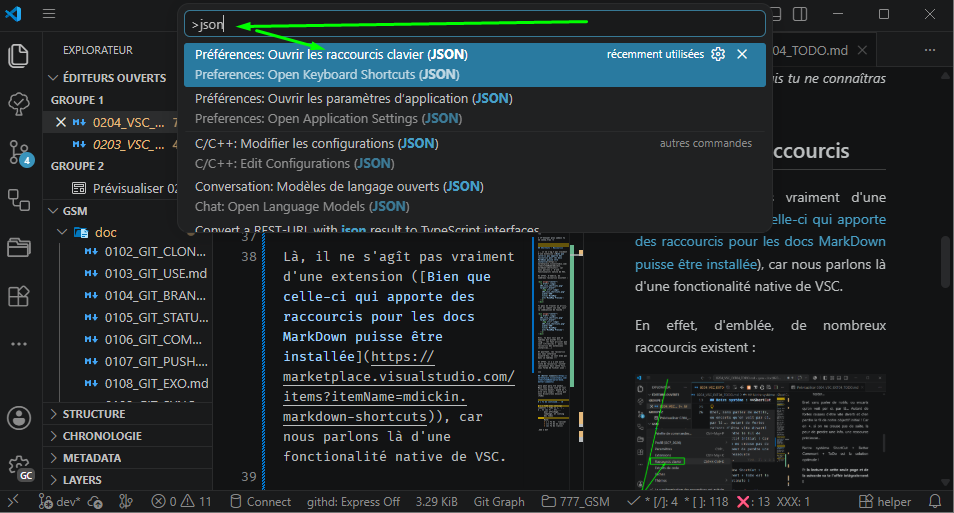
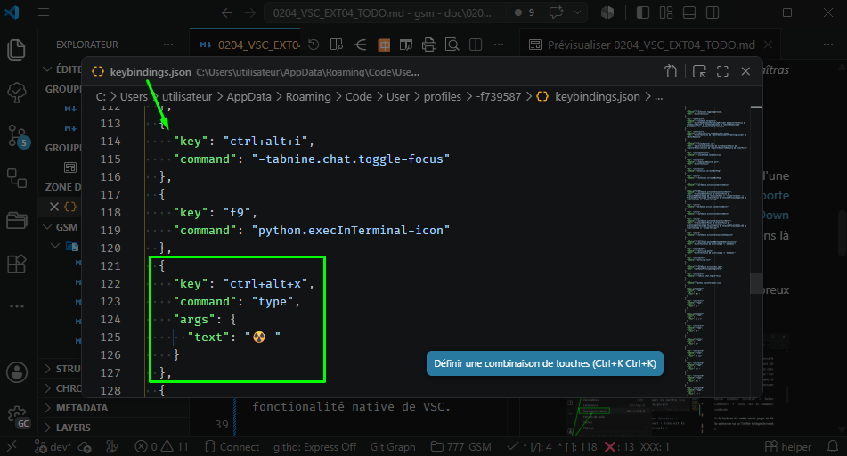

<h3>
<a href="./doc/0001_TOC.md" title="Table Of Content">TOC</a>
</h3>

<h1>
VSC - Extensions Organisationnelles
</h1>

<h3 align="center">
  <a href="./0203_VSC_XXX.md">← XXX</a>
                     
  <a href="./0205_VSC_XXX.md">XXX →</a>
</h3>

---

## Notre système : **ShortCuts + Better Comment + ToDo → Efficience GARANTIE !**

Les "ToDo list", tu connais... Tu en a peut-être même "codé le code", une appli dans le cadre de l'apprentissage d'un langage ou autre...

Mais pour nous, cette extension va nous permettre de gagner énormément en efficience !

En effet, quand on code, une bonne partie de notre temps consiste à toujours apprendre... On en lis, des signatures, on en voit, des exemples, etc...

Mais du coup, ça peut éveiller en nous plusieurs choses :

- Dans une doc, on tombe sur une notion qu'on aimerait bien appronfondir pour X raisons,
- Et dans notre réflexion, la pensée d'autres choses à absolument tester au + vite...

Bref, sans parler de notifs, ou encarts qu'on voit par ci, par là... Autant de fortes raisons d'être vite divertis et d'en perdre complètement le fil de notre objectif initial ! Car en +, si on ne creuse pas de suite, on garde aussi la peur de perdre une info, peut-être cruciale, d'une ressource précieuse...

Notre système ShortCut + Better Comment + ToDo est la **Solution Optimal**e !

Et **la lecture de cette seule page et de la suivante va te l'offrir intégralement !**

→ *Et en +, t'ennuyer plus jamais tu ne connaîtras !*

## ShortCuts - Raccourcis (Json)

Là, il ne s'agît pas vraiment d'une extension ([Bien que si tu cliques là, sur 'ces mots bleus', celle-ci t'apporte des raccourcis spécifiques pour les docs rédigées en MarkDown](https://marketplace.visualstudio.com/items?itemName=mdickin.markdown-shortcuts)), car nous parlons là d'une fonctionalité native de VSC.

En effet, d'emblée, de nombreux raccourcis (claviers → *keybindings*) existent :

  

Tu peux en trouver un précis, soit en tapant son nom, soit sa combinaison de touches :

  

Donc, tu dois voir que ce tableau est plutôt très long... (Il faut préciser que sont référencées là aussi tous les raccourcis des extensions installées...)

Et pourtant, les raccourcis qui nous interessent aujourd'hui, ne sont même pas dans ce tableau !!! En effet, il y a une autre liste de raccourcis 'customs' (personels) mais cette fois, sous forme d'un fichier `.json` :

### 👉 Pour éditer ce fichier: **CTRL +MAJ + P** et saisir quelques lettres

  

Et voici comment en rajouter un : Exemple: **CTRL + ALT + x**

  

### 👉 Édite ce fichier et remplace son contenu par celui du fichier [gsm\doc\files\keybindings.json](..\doc\files\keybindings.json)

🦄 Démo usage finale ?

## [Better Comments](https://marketplace.visualstudio.com/items?itemName=aaron-bond.better-comments)

Cela peut paraître anodin... Mais vous allez vite en voir l'intérêt majeur, quand en +, elle sera couplée à celle que nous décourirons ensuite (ToDo)

# ❌ To be continued... 🚧
