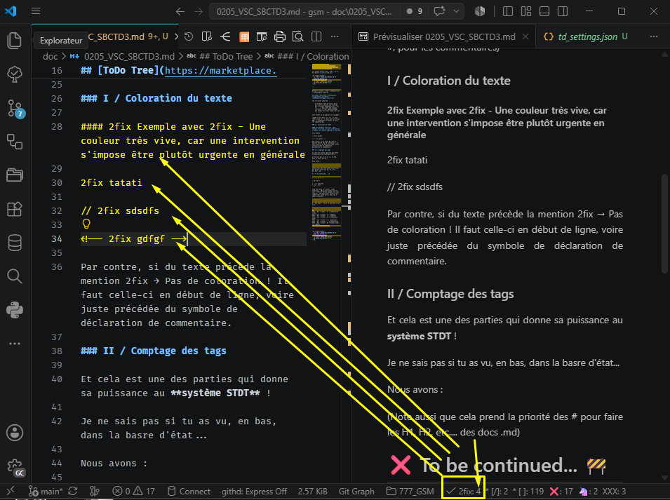
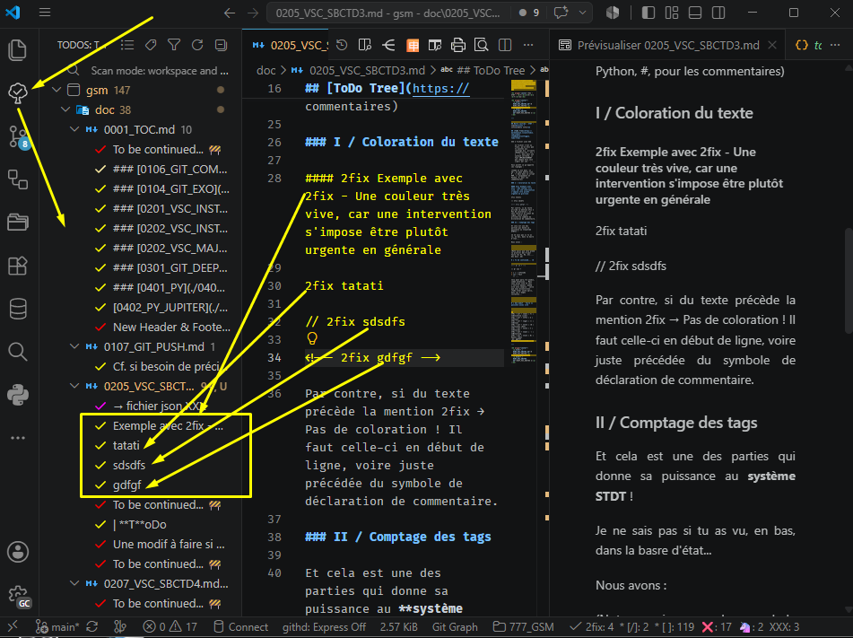
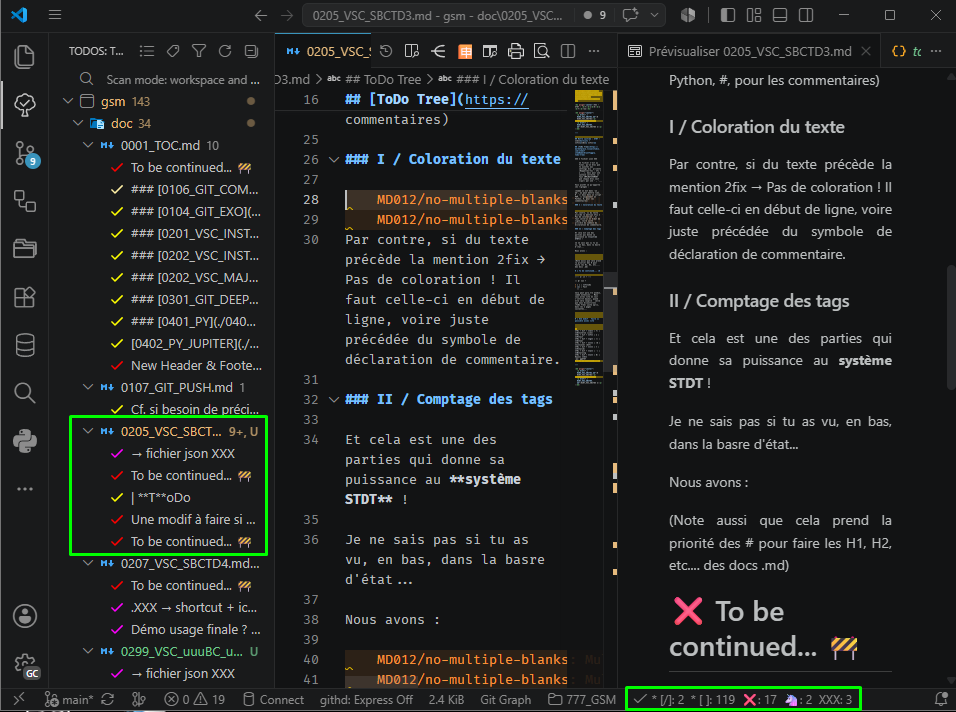
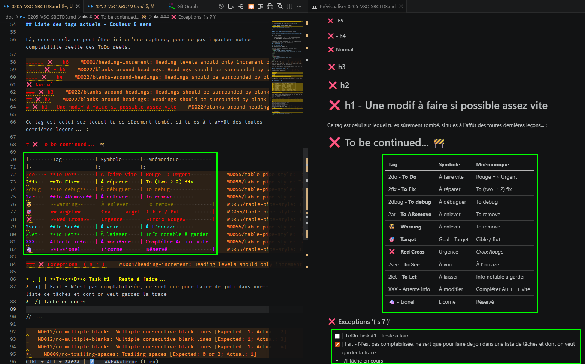
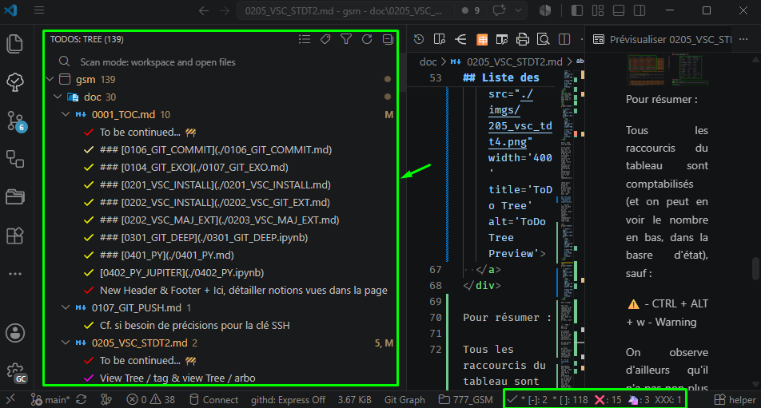

<h3 align='right'><a href="./0001_TOC.md" title="Table Of Content">TOC</a></h3>

<h1 align='center'>VSC - <b>STDT</b> - <b>T</b>o<b>D</b>o <b>T</b>ree</h1>

<h3 align="center">
  <a href="./0204_VSC_STDT1.md">← 0204_VSC_STDT1</a>
                     
  <a href="./0206_VSC_STDT3.md">0206_VSC_STDT3 →</a>
 →</a>
</h3>

---

## Élément 2 : [ToDo Tree](https://marketplace.visualstudio.com/items?itemName=Gruntfuggly.todo-tree)

### 👉 Pour avoir immédiatement les settings qui nous intéressent : Édite ce fichier : [gsm/doc/files/td_settings.json](./files/td_settings.json) et ajoute son contenu à celui du fichier `settings.json` (Rappelles-toi des paramétrages dans VSC : [CTRL + ' , '](./0200_VSC_INSTALL.md))

⚠️ Ce fichier n'est au final, qu'un bloc que tu ajoutes aux settings déjà présents mais pour une syntaxe correcte, il faut IMPÉRATIVEMENT que chaque bloc soit séparé par une ' , '...

Vois plutôt ce qu'apporte ces réglages :

(Comme on est dans 'un .md', on peut mettre rien, # , // mais dans un script PHP, // uniquement et Python, #, pour les commentaires)

### I / Coloration du texte

### II / Comptage des tags

Une image vaut mieux que 1 000 mots, non ?

Et cela est ce qui donne toute sa puissance au **système STDT** !

  

 

Et voilà le 2ème effet Kiss cool de ToDo Tree :

 

  

Alors, note tout de même :

Si du texte précède le tag, ici, la mention 2fix → Pas de coloration ! Il faut celle-ci en début de ligne, voire juste précédée du symbole de déclaration de commentaire. Et du coup, elle n'est pas comptabilisée...

(Note aussi que STDT prend la priorité des # pour faire les H1, H2, etc.... des docs .md)

Et l'effet Kisso Cool...? Ouvre l'arbre des Todo, et clic sur une d'elle ! Ça t'emène directement dans le fichier à la ligne du tag 👌 !

## Liste des tags actuels - Couleur & Signification

Là, encore cela ne peut être ici qu'une capture, pour ne pas impacter notre comptabilité réelle des ToDo réels (Dont le nombre est visible dans notre barre d'état, en bas du VSC).

  

Mais globalement, tu verras ce genre de lignes très colorées our êtres très distinctes, que tu soies dans du doc, du jupyter, du php, du py, du... Enfin, partout !

  

Pour résumer :

Tous les raccourcis du tableau sont comptabilisés (et on peut en voir le nombre en bas, dans la basre d'état), sauf :

⚠️ - CTRL + ALT + w - Warning

On observe d'ailleurs qu'il n'a pas non plus de coloration particulière.

Et une autre exception !

' * [-] ' : En Cours.... Tâche ouverte (Colorée en beige) - Un contributeur est dessus...

### 👉 Maintenant, pour donner raison à Yoda (Voire en haut de la page précédente....), si tu n'as pas d'emblée, une idée de dev, ou ne vois pas grand chose à modifier pour corriger, améliorer ou compléter, regardes l'arbre des Todo en place...
Choisis-en une, et baptise ta branche selon la portée... Et go jusqu'à la PR ! 💪

  

---

<h3 align="center">
  <a href="./0204_VSC_STDT1.md">← 0204_VSC_STDT1</a>
                     
  <a href="./0206_VSC_STDT3.md">0206_VSC_STDT3 →</a>
 →</a>
</h3>
