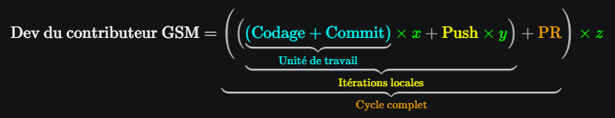

<h3 align='right'><a href="./0001_TOC.md" title="Table Of Content">TOC</a></h3>

<h1 align='center'>GIT DEEP - <b>GG</b></h1>

<h3 align="center">
  <a href="./0206_VSC_STDT3.md">← 0206_VSC_STDT3</a>
                     
  <a href="./0301_GG_READ.md">0301_GG_READ →</a>
</h3>

---

## GIT DEEP - GIT Approfondi : Objectifs de la série 03xx

Après la série 01xx (CLI) et 02xx (VSC + extensions), la série 03xx traite les flux de travail avancés :

- Lire et piloter l'historique comme un graphe,
- choisir la bonne stratégie (Merge, rebase, cherry-pick),
- récupérer rapidement après erreur (Reflog, bisect, stash).

Ici, **G**it **G**raph est l'**interface principale**, **et** la **CLI** reste le **plan B** fiable.

---

## Programme complet de la série 03

|                                                     |                                                         |
|-----------------------------------------------------|---------------------------------------------------------|
| [0300_GIT_DEEP](./0300_GIT_DEEP.md)                 | [0307_GIT_WORKTREE](./0307_GIT_WORKTREE.md)             |
| [0301_GG_READ](./0301_GG_READ.md)                   | [0308_GIT_CONFLICTS_DEEP](./0308_GIT_CONFLICTS_DEEP.md) |
| [0302_GIT_HISTORY_SAFE](./0302_GIT_HISTORY_SAFE.md) | [0309_GIT_RESCUE](./0309_GIT_RESCUE.md)                 |
| [0303_GIT_CHERRY_PICK](./0303_GIT_CHERRY_PICK.md)   | [0310_GIT_GRAPH_LIMITS](./0310_GIT_GRAPH_LIMITS.md)     |
| [0304_GIT_BISECT](./0304_GIT_BISECT.md)             | [0311_GIT_DEEP_EXO](./0311_GIT_DEEP_EXO.md)             |
| [0305_GIT_STASH_PATCH](./0305_GIT_STASH_PATCH.md)   | [0312_GIT_DEEP_CHECKLIST](./0312_GIT_DEEP_CHECKLIST.md) |
| [0306_GIT_TAG_RELEASE](./0306_GIT_TAG_RELEASE.md)   | [0377_TP](./0377_TP.md)                                 |

---

## Rappel du cycle de dev parfait d'un codeur

  

---

## Méthode de travail recommandée

1. Lire et comprendre dans Git Graph
2. Exécuter l'action la plus sûre (GG ou CLI)
3. Vérifier immédiatement le graphe et `git status`

Si un cas est sensible (secours, bisect, opérations avancées), priorise la CLI puis reviens sur Git Graph pour comprendre + facilement visuellement.

---

<h3 align="center">
  <a href="./0206_VSC_STDT3.md">← 0206_VSC_STDT3</a>
                     
  <a href="./0301_GG_READ.md">0301_GG_READ →</a>
</h3>
