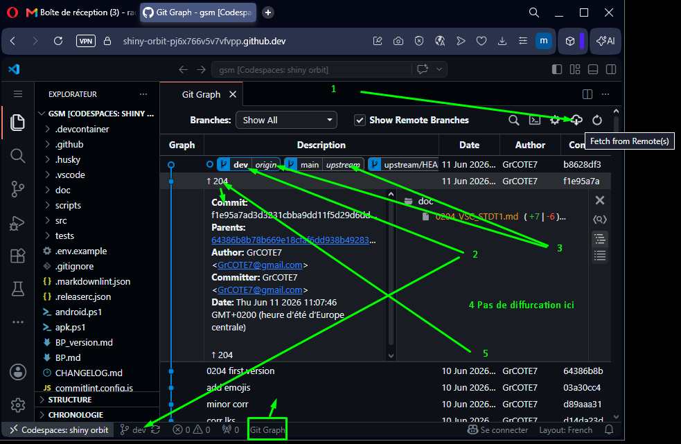

<h3 align='right'><span style="text-decoration:none;"><a href="./0001_TOC.md" title="Table Of Content">TOC</a></span></h3>

<h1 align='center'>01/12. GIT DEEP - GG - Lire le Graphe</h1>

<h3 align="center">
  <a href="./0300_GIT_DEEP.md">← 0300_GIT_DEEP</a>
                     
  <a href="./0302_GIT_HISTORY_SAFE.md">0302_GIT_HISTORY_SAFE →</a>
</h3>

---

## Objectif

Savoir lire un historique Git comme une carte routière :

- Qui est en avance, en retard, ou diverge,
- quel commit est où,
- et quelle action choisir sans te tromper.

---

## Version Git Graph (VSC)

Dans [Git Graph](https://marketplace.visualstudio.com/items?itemName=mhutchie.git-graph), commence toujours par :

<div align="center">
  <a href="./imgs/301_gg.png" target="_blank">
    
  </a>
</div>

1. `Fetch form remote`
2. Regarder la branche en gras (branche active) également indiquée en bas à gauche
3. Regarder les étiquettes de branches distantes (`origin/main`, `upstream/main`)
4. Identifier les bifurcations (divergence)
5. Double-cliquer un commit pour inspecter son contenu

Si ta branche locale est derrière `upstream/main`, tu verras la pointe `upstream/main` plus haut dans le graphe.

---

## Équivalence CLI (Filet de sécurité)

```bash
git status
git branch -vv
git log --oneline --decorate --graph --all -n 25
git fetch
```

Lecture rapide :

- `ahead N` = tu as des commits pas encore poussés
- `behind N` = il te manque des commits distants
- `diverged` = vous avez chacun avancé de votre côté

---

## Réflexe de décision (simple)

- `behind` seulement : pull (ou fetch + merge/rebase)
- `ahead` seulement : push
- `diverged` : comparer, puis merge ou rebase en conscience
- doute : inspecter commit par commit dans Git Graph

---

## Mini-exercice

1. Ouvre Git Graph
2. Trouve ta branche active
3. Compare la position de `origin/main` et `upstream/main`
4. Dis si ton dépôt est `ahead`, `behind` ou `diverged`
5. Trouve 2 ou 3 modifications (Au moins 1 s'il y en qu'une) lors du dernier commit (Nom d'un fichier + les modifications dedans)

---

<h3 align="center">
  <a href="./0300_GIT_DEEP.md">← 0300_GIT_DEEP</a>
                     
  <a href="./0302_GIT_HISTORY_SAFE.md">0302_GIT_HISTORY_SAFE →</a>
</h3>
