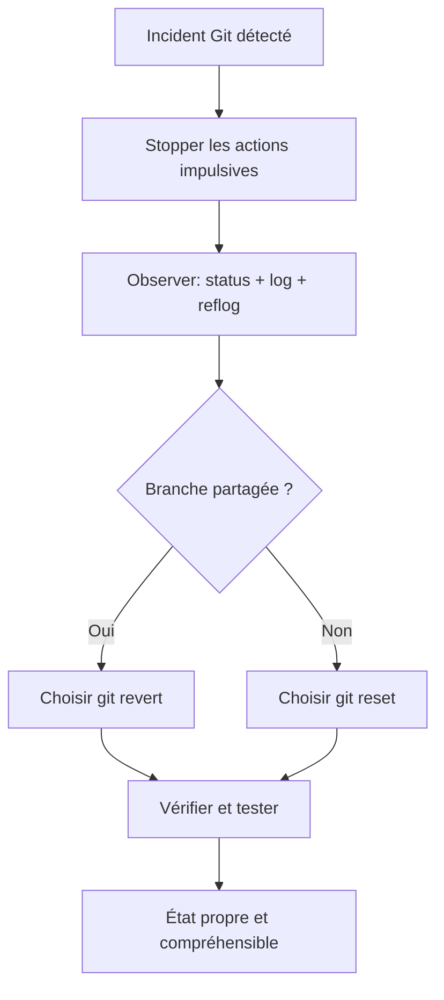

<h3 align='right'><span style="text-decoration:none;"><a href="./0001_TOC.md" title="Table Of Content">TOC</a></span></h3>

<h1 align='center'>09/12. GIT DEEP - Mode secours</h1>

<h3 align="center">
  <a href="./0308_GIT_CONFLICTS_DEEP.md">← 0308_GIT_CONFLICTS_DEEP</a>
                     
  <a href="./0310_GIT_GRAPH_LIMITS.md">0310_GIT_GRAPH_LIMITS →</a>
</h3>

---

## Objectif

Récupérer une situation "cassée" sans paniquer.



---

## Trousse d'urgence CLI

```bash
# Historique local des mouvements de HEAD
git reflog

# Revenir à un état donné (dangereux pour les modifs non commitées)
git reset --hard <sha>

# Annuler un commit par un commit inverse (sûr en partage)
git revert <sha>
```

---

## Méthode

1. Stopper les actions impulsées
2. Photographier l'état (`git status`, `git log --oneline -n 15`)
3. Choisir `revert` si branche partagée
4. Choisir `reset` surtout en local privé

---

## Mini-exercice

1. Fais un commit volontairement mauvais
2. Teste `git revert` pour annuler proprement
3. Observe le graphe et compare avec un reset

---

<h3 align="center">
  <a href="./0308_GIT_CONFLICTS_DEEP.md">← 0308_GIT_CONFLICTS_DEEP</a>
                     
  <a href="./0310_GIT_GRAPH_LIMITS.md">0310_GIT_GRAPH_LIMITS →</a>
</h3>
