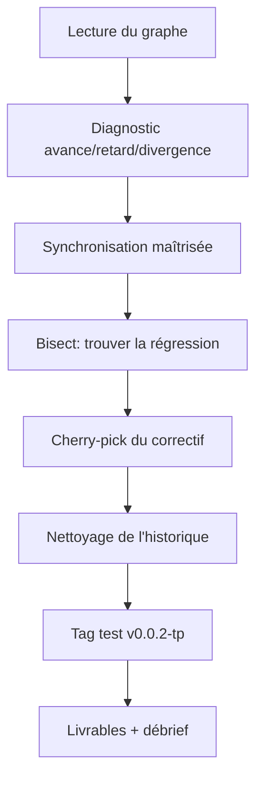

<h3 align='right'><a href="./0001_TOC.md" title="Table Of Content">TOC</a></h3>

<h1 align='center'>0377. TP GIT DEEP - Exercice complet</h1>

<h3 align="center">
  <a href="./0312_GIT_DEEP_CHECKLIST.md">← 0312_GIT_DEEP_CHECKLIST</a>
                     
  <a href="./0401_PY.md">0401_PY →</a>
</h3>

---

## Contexte

Tu interviens sur un dépôt qui présente 3 problèmes :

- Ta branche diverge de `upstream/main`,
- un bug est apparu "récemment",
- un correctif urgent doit être repris sur une autre branche.

Ton objectif est de livrer une branche propre, relisible et publiable.

---

## Missions

1. Lire le graphe et poser un diagnostic (`ahead`, `behind`, `diverged`)
2. Synchroniser sans perdre de travail
3. Trouver le commit fautif avec `bisect`
4. Reprendre un correctif via cherry-pick
5. Nettoyer l'historique (rebase/amend)
6. Poser un tag de release de test (`v0.0.2-tp`)

---

## Contraintes

- Priorité à Git Graph pour visualiser
- CLI autorisée dès que plus robuste/rapide
- Aucune commande destructive sans justification

---

Tu n'es pas obligé de faire cet exercice...

Par contre, sache bien qu'il existe et résume la procédure en cas de gros problème qui pourrait un jour t'arriver sur ton dépôt...

Mais n'oublie pas qu' au pire, tu ne plus jamais tout perdre, car travaillant TOUJOURS sur une branche spécifique, autre que `main`.

---

### 👉 Même si ce TP, tu t'es juste limité à en lire le contenu, tu mérites quand-même d'avoir ton Niveau 🎖️ mis à jour dans le **[Tableau d'Honneur](./7777_SUIVIS.md) ✌️**

→ Tu peux donc y mettre maintenant ton niveau : **0400** 🎉 - Et dans la foulée, fais bien-sûr la PR pour que cela soit officiel 💪

---

<h3 align="center">
  <a href="./0312_GIT_DEEP_CHECKLIST.md">← 0312_GIT_DEEP_CHECKLIST</a>
                     
  <a href="./0401_PY.md">0401_PY →</a>
</h3>
