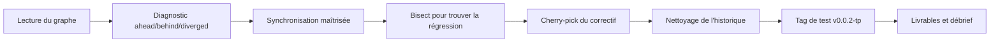

<h3 align='right'><a href="./0001_TOC.md" title="Table Of Content">TOC</a></h3>

<h1 align='center'>0377. TP GIT DEEP - Exercice complet</h1>

<h3 align="center">
  <a href="./0312_GIT_DEEP_CHECKLIST.md">← 0312_GIT_DEEP_CHECKLIST</a>
                     
  <a href="./0401_PY.md">0401_PY →</a>
</h3>

---

## Contexte

Tu interviens sur un dépôt qui présente 3 problèmes :

- Ta branche diverge de `upstream/main`,
- un bug est apparu "récemment",
- un correctif urgent doit être repris sur une autre branche.

Ton objectif est de livrer une branche propre, relisible et publiable.

---

## Missions

1. Lire le graphe et poser un diagnostic (`ahead`, `behind`, `diverged`)
2. Synchroniser sans perdre de travail
3. Trouver le commit fautif avec `bisect`
4. Reprendre un correctif via cherry-pick
5. Nettoyer l'historique (rebase/amend)
6. Poser un tag de release de test (`v0.0.2-tp`)

---

## Contraintes

- Priorité à Git Graph pour visualiser
- CLI autorisée dès que plus robuste/rapide
- Aucune commande destructive sans justification

---

## Livrables

- Une capture du graphe final
- Une liste des commandes exécutées
- 5 lignes de retour d'expérience : ce qui était simple, ce qui était risqué

---

## Barème simple

- 40% résultat technique
- 30% qualité de l'historique
- 20% capacité de récupération après erreur
- 10% clarté d'explication

---

❌  → 777

---

<h3 align="center">
  <a href="./0312_GIT_DEEP_CHECKLIST.md">← 0312_GIT_DEEP_CHECKLIST</a>
                     
  <a href="./0401_PY.md">0401_PY →</a>
</h3>
