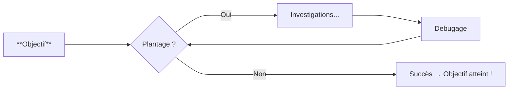

# Pyhon - Bases

## Vous avez dit "Programmation"...?

* [ ] To be continued... 🚧

$$
\textcolor{white}{\text{Dev du contributeur GSM} =}
\underbrace{
\Bigg(
    \Big(
      \underbrace{
          \underbrace{
            \textcolor{cyan}{(\text{Codage} + \text{Commit})}
          }_{\textcolor{cyan}{\text{Unité de travail}}}
          \textcolor{lime}{\times x}
          + \textcolor{yellow}{\text{Push}}
        \textcolor{lime}{\times y}
      \Big)
      }_{\textcolor{yellow}{\text{Itérations locales}}}
      + \textcolor{orange}{\text{PR}}
    }_{\textcolor{orange}{\text{Cycle complet}}}
\Bigg)\textcolor{lime}{\times z}
$$

<!-- 💡 Tous linuxien et MacOxien sont invités à compléter ces docs pour adapter ces helpers sur ces Mc et bien-sûr, générer les **PR** qui s'imposent alors... -->

