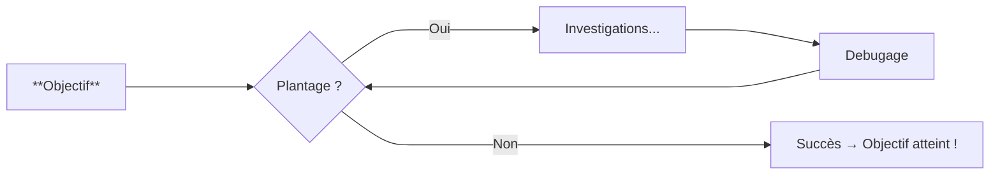

# Pyhon - Bases

## Vous avez dit "Programmation"...?

```mermaid
graph LR
  A[**Objectif**]---->B{Plantage ?};
  B---->|Oui| C[Investigations...];
  C--->D[Debugage];
  D-->B;
  B------>|Non| E[Succès → Objectif atteint !];
```

* [ ] To be continued... 🚧
