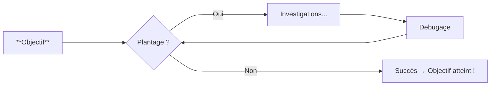

# Pyhon - Bases

## Vous avez dit "Programmation"...?

$$
\text{Travail du codeur} =
\underbrace{
  \underbrace{
    \underbrace{
      \underbrace{\text{codage} + \text{commit}}_{\text{base}}
      \times N
    }_{\text{boucle N}}
    + \text{push}
  }_{\text{après push}}
  \times M
  + \text{PR}
}_{\text{avant factorisation}}
\times P
$$

$$
\text{Travail du codeur} =
\underbrace{
  \Bigg(
    \underbrace{
      \Big(
        \underbrace{\text{codage} + \text{commit}}_{\text{unité de travail}}
      \Big)\times N
    }_{\text{itérations locales}}
    + \text{push}
  \Bigg)\times M
  + \text{PR}
}_{\text{cycle complet}}
\times P
$$

$$
\text{Rôle du contributeur GSM} =
\Bigg(
\underbrace{
  \Big(
    \underbrace{
      (
        \underbrace{\text{Codage} + \text{Commit}}_{\text{Unité de travail}}
      )\times x
    }_{\text{Itérations locales}}
    + \text{Push}
  \Big)\times y
  + \text{PR}
\Bigg)
}_{\text{Cycle complet}}
\times z
$$
