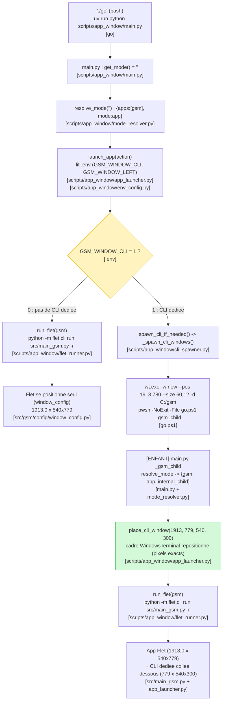

# ./go

## Récapitulatif

| Fonction                                         | Fichier                               |
| ------------------------------------------------ | ------------------------------------- |
| Script d'entrée bash                             | `go` (racine)                         |
| Lanceur PowerShell                               | `go.ps1` (racine)                     |
| Lecture des args + dispatch                      | `scripts/app_window/main.py`          |
| Résolution du mode (dont `_gsm_child`)           | `scripts/app_window/mode_resolver.py` |
| Orchestration (`launch_app`, `place_cli_window`) | `scripts/app_window/app_launcher.py`  |
| Ouverture de la CLI wt + chemins pwsh/wt         | `scripts/app_window/cli_spawner.py`   |
| Commande Flet (`sys.executable -m flet.cli`)     | `scripts/app_window/flet_runner.py`   |
| Lecture du `.env`                                | `scripts/app_window/env_config.py`    |
| Géométrie/positionnement de la fenêtre de l'app  | `src/gsm/config/window_config.py`     |

## Organigramme

## Cycle de vie (depuis le fix "l'app ne survit plus à sa CLI")

`run_flet()` (flet_runner.py) est **bloquant** : le launcher reste vivant tant que
l'app Flet tourne, et **la fermeture de la CLI ferme l'app** :

- **CTRL+C** → `KeyboardInterrupt` → `finally` → `taskkill /PID <flet> /T /F`
  (toute l'arborescence `uv → python → flet → app` est tuée).
- **Croix / logoff / shutdown** (Windows) → handler de console
  (`_watchdog_console_close`) qui tue l'arborescence avant la terminaison.
- **Linux** → SIGINT / SIGHUP atteignent naturellement tout le groupe de process.

Conséquence : en mode multi-apps **sans CLI dédiée** (`./go gu`, `_CLI=0`), chaque
app est lancée dans son **propre process** (`_spawn_app_detached`, mode interne
`_gsm_nocli`), sinon un `run_flet` bloquant empêcherait le lancement des suivantes.

