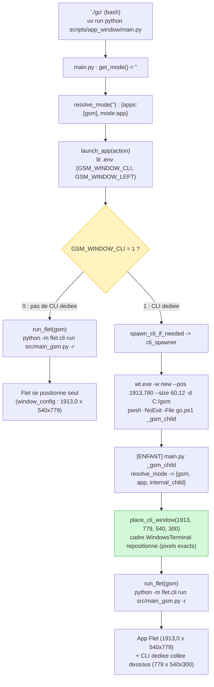

# ./go

```mermaid
flowchart TD
    A["'./go' (bash)<br/>uv run python scripts/app_window/main.py"] --> B["main.py : get_mode() = ''"]
    B --> C["resolve_mode('') : {apps:[gsm], mode:app}"]
    C --> D["launch_app(action)<br/>lit .env (GSM_WINDOW_CLI, GSM_WINDOW_LEFT)"]

    D --> E{"GSM_WINDOW_CLI = 1 ?"}

    E -- "0 : pas de CLI dediee" --> F["run_flet(gsm)<br/>python -m flet.cli run src/main_gsm.py -r"]
    F --> G["Flet se positionne seul<br/>(window_config : 1913,0 x 540x779)"]

    E -- "1 : CLI dediee" --> H["spawn_cli_if_needed -> cli_spawner"]
    H --> I["wt.exe -w new --pos 1913,780 --size 60,12 -d C:/gsm<br/>pwsh -NoExit -File go.ps1 _gsm_child"]

    I --> J["[ENFANT] main.py _gsm_child<br/>resolve_mode -> {gsm, app, internal_child}"]
    J --> K["place_cli_window(1913, 779, 540, 300)<br/>cadre WindowsTerminal repositionne (pixels exacts)"]
    K --> L["run_flet(gsm)<br/>python -m flet.cli run src/main_gsm.py -r"]
    L --> M["App Flet (1913,0 x 540x779)<br/>+ CLI dediee collee dessous (779 x 540x300)"]

    style E fill:#fff3bf,stroke:#e6b800
    style K fill:#d3f9d8,stroke:#37b24d

```