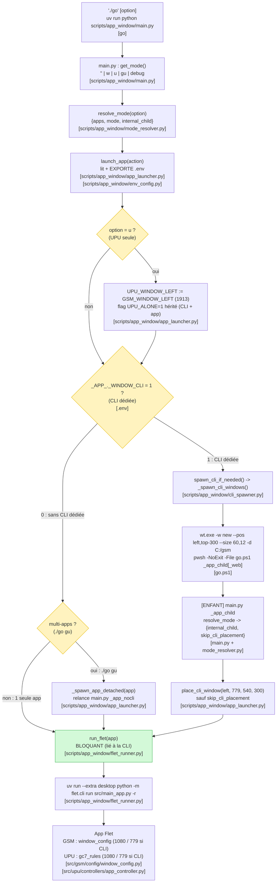

# ./go

Starter unique : ouvre **GSM** (déclaratif) et/ou **UPU** (impératif), en mode
APP ou WEB, avec ou sans CLI dédiée, selon l'option demandée et les 2 variables
binaires `GSM_WINDOW_CLI` / `UPU_WINDOW_CLI` — soit **10 combinaisons distinctes**.

## Récapitulatif

| Fonction | Fichier |
| --- | --- |
| Script d'entrée bash | `go` (racine) |
| Lanceur PowerShell (choix de l'interpréteur) | `go.ps1` (racine) |
| Lecture des args + dispatch | `scripts/app_window/main.py` |
| Résolution du mode (public + interne `_child` / `_nocli`) | `scripts/app_window/mode_resolver.py` |
| Orchestration (`launch_app`, `place_cli_window`, UPU seule, multi-apps détaché) | `scripts/app_window/app_launcher.py` |
| Ouverture CLI wt + chemins pwsh/wt | `scripts/app_window/cli_spawner.py` |
| Lancement Flet **bloquant** + cycle de vie (CTRL+C / croix / watchdog) | `scripts/app_window/flet_runner.py` |
| Lecture + **export** du `.env` vers les process enfants | `scripts/app_window/env_config.py` |
| Géométrie fenêtre GSM | `src/gsm/config/window_config.py` |
| Géométrie fenêtre UPU (`gc7_rules`) | `src/upu/controllers/app_controller.py` + `src/gc7_tools/screen_utils.py` |
| Démo interactive des 10 configs | `scripts/app_window/demo_configs.py` |

## Modes de lancement

| Commande | Apps | Mode | Variable utile |
| --- | --- | --- | --- |
| `./go` | GSM | APP | `GSM_WINDOW_CLI` |
| `./go w` | GSM | WEB | `GSM_WINDOW_CLI` |
| `./go u` | UPU | APP (forcée à `GSM_WINDOW_LEFT`) | `UPU_WINDOW_CLI` |
| `./go gu` | GSM + UPU | APP | les deux |
| `./go debug` | — | diagnostic (`debug_dump`) | — |

## Organigramme

## Cycle de vie (l'app ne survit plus à sa CLI)

`run_flet()` (flet_runner.py) est **bloquant** : le launcher reste vivant tant que
l'app Flet tourne, et **la fermeture de la CLI ferme l'app** :

- **CTRL+C** → `KeyboardInterrupt` → `finally` → `taskkill /PID <flet> /T /F`
  (toute l'arborescence `uv → python → flet → app` est tuée).
- **Croix / logoff / shutdown** (Windows) → handler de console
  (`_watchdog_console_close`) qui tue l'arborescence avant la terminaison.
- **Linux** → SIGINT / SIGHUP atteignent naturellement tout le groupe de process.

Conséquence : en mode multi-apps **sans CLI dédiée** (`./go gu`, `_CLI=0`), chaque
app est lancée dans son **propre process** (`_spawn_app_detached`, mode interne
`_app_nocli`), sinon un `run_flet` bloquant empêcherait le lancement des suivantes.

## Cas particulier : UPU seule (`./go u`)

Quand UPU est seule, inutile de laisser vide la place réservée à GSM : la
position effective devient `GSM_WINDOW_LEFT` (1913), avec ou sans CLI dédiée.
Le launcher force `UPU_WINDOW_LEFT := GSM_WINDOW_LEFT` et pose le flag
`UPU_ALONE=1` (hérité par la CLI dédiée et l'app, réappliqué idempotent)
— [scripts/app_window/app_launcher.py].

## Démo des 10 combinaisons

`python scripts/app_window/demo_configs.py`
([scripts/app_window/demo_configs.py]) : enchaîne les 10 configs distinctes.
Pour chacune : patch du `.env` → lancement → affichage en CLI → attente d'une
touche (focus ramené sur la console) → fermeture des CLI dédiées (`WM_CLOSE`)
+ kill des process → config suivante. Le `.env` d'origine est restauré à la fin.
