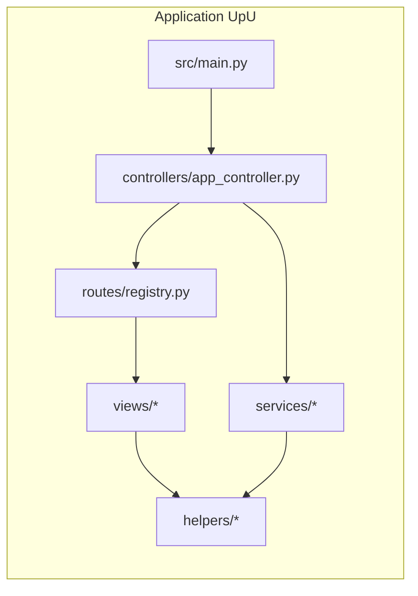
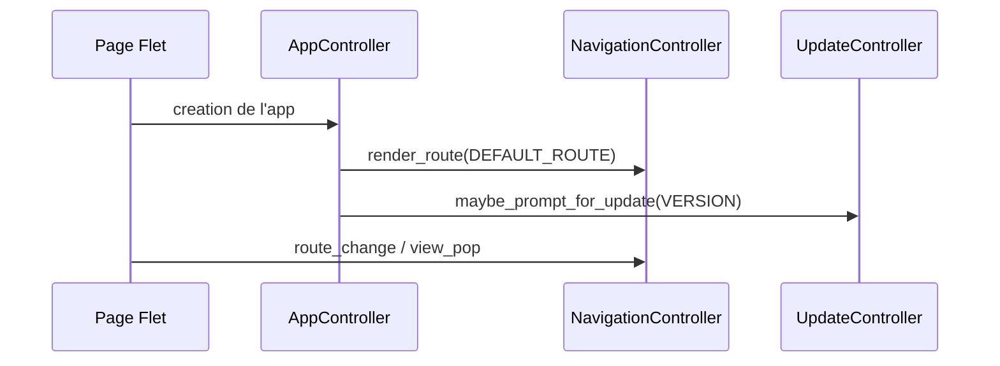
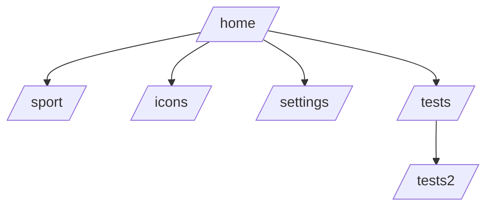
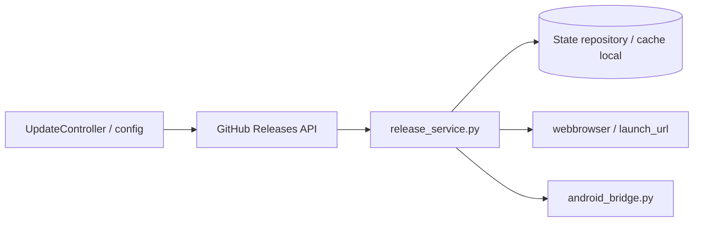

# Wikidoc - Projet GSM (UpU)

Disclaimer: Merci à Bruno Brown pour nous avoir permis de découvrir WikiDoc ([Version par Gemini](https://discord.com/channels/981374556059086931/1219578168093184050/1507379031463690256))

## Presentation
GSM est le depot de l'application UpU, developpee en Python avec Flet.

Le coeur applicatif vit sous src/upu avec une separation claire entre controllers, views, services et helpers.

### Vue d'ensemble


## Objectifs actuels
- Fournir une application Flet multi-plateforme (desktop, Android, iOS)
- Integrer des outils audio et des pages utilitaires (tests, icones, sport, settings)
- Gerer la navigation et la logique d'update GitHub de maniere robuste
- Conserver un workflow de build/release reproductible via uv + scripts PowerShell

## Structure reelle du depot
Arborescence utile (simplifiee):

```text
src/
|- main.py
|- audio.py
|- beep_engine.py
|- countdown.py
|- gc7_tools/
`- upu/
   |- config.py
   |- app_data/
   |- controllers/
   |- helpers/
   |- i18n/
   |- models/
   |- routes/
   |- services/
   |- ui/
   `- views/

tests/
|- test_release_service.py
`- test_smoke.py

scripts/
|- check_version_sync.ps1
|- upload_drive_workflow.py
`- ...

go.ps1
apk.ps1
pyproject.toml
README.md
```

## Environnement et prerequis
- Python >= 3.13
- uv
- Flet 0.85.x
- Android SDK pour les builds APK

Installation:

```bash
uv sync
```

## Lancement de l'application
Option recommandee sous Windows (wrapper repo):

```powershell
./go
```

Equivalent commande explicite:

```powershell
uv run --active python -m flet.cli run -r
```

## Build APK
Option recommandee sous Windows (wrapper repo):

```powershell
./apk
```

Equivalent commande explicite:

```powershell
uv run --active python -m flet.cli build apk -v
```

Note: dans ce projet, le dossier build/ est un artefact genere et non une source de verite pour des correctifs permanents.

## Architecture applicative

### Point d'entree
src/main.py:

```python
import flet as ft
import flet_audio  # noqa: F401

from upu.controllers.app_controller import create_app

ft.run(create_app)
```

### Controller principal
AppController configure:
- le titre de fenetre et les regles d'ecran
- les handlers Flet (route change, view pop, lifecycle)
- le rendu de la route par defaut
- la verification de mise a jour asynchrone



### Routing
Le registre des routes est defini dans src/upu/routes/registry.py.

Routes exposees actuellement:
- /home
- /sport
- /icons
- /settings
- /tests
- /tests2



### Services
Exemples importants:
- release_service.py: gestion d'ouverture de release et journalisation du flux d'update
- update_service.py: logique de detection/mise a jour
- i18n_service.py: support internationalisation
- android_bridge.py: pont Android natif (intent URL, force_exit)



### Helpers
helpers/app_actions.py fournit des actions transverses:
- open_url(...): ouverture externe selon plateforme
- close_app(...): fermeture propre (ou sortie Android)

## Tests
Le dossier tests contient actuellement:
- test_release_service.py
- test_smoke.py

La couverture de tests existe deja, mais reste partielle sur l'ensemble des vues.

## Versioning et release
- Le versioning semantique est utilise dans le flux release
- L'alignement de version est verifie par scripts/check_version_sync.ps1
- Les metadonnees locales de build/version sont utilisees dans la logique de carte update

## Contribution
- Garder des commits clairs et focalises
- Eviter les changements permanents dans les artefacts build/
- Preferer les scripts racine (./go, ./apk) pour executer les commandes standards du projet

## Roadmap realiste (mise a jour)
- [ ] Etendre la couverture de tests (controllers/views/services)
- [ ] Renforcer l'i18n existante (contenu et fallback)
- [ ] Poursuivre l'amelioration UX/UI des vues
- [ ] Durcir encore le flux update/release (cas reseau et erreurs mobiles)
- [ ] Ajouter de la documentation technique par sous-module (controllers/services/views)
